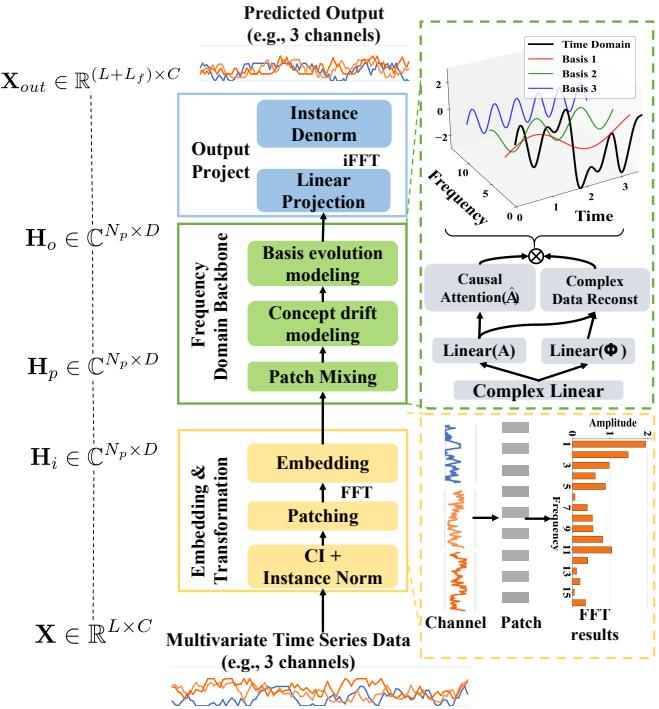
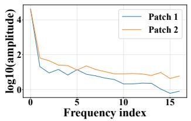
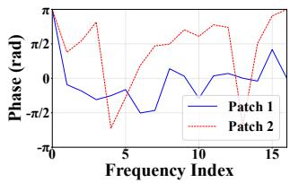
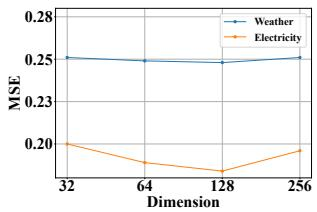
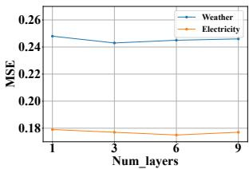
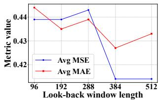
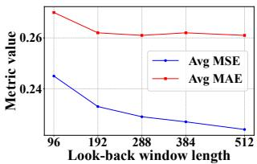

# A Unified Frequency Domain Decomposition Framework for Interpretable and Robust Time Series Forecasting

Cheng He cheng.he@mail.ustc.edu.cn University of Science and Technology of China Hefei, China

Patrick P.C. Lee pclee@cse.cuhk.edu.hk The Chinese University of Hong Kong Hong Kong, China

Hong Xie xiehong2018@foxmail.com University of Science and Technology of China Hefei, China

Xijie Liang lxjie@blackwingasset.com Shanghai Black Wing Asset Management Co., Ltd. Shanghai, China

Xu Huang xuhuangcs@mail.ustc.edu.cn University of Science and Technology of China Hefei, China

Defu Lian liandefu@ustc.edu.cn University of Science and Technology of China Hefei, China

Zengrong Zheng lxjie@blackwingasset.com Di-Matrix(Shanghai) Information Technology Co., Ltd. Shanghai, China

Zhaoyi Li lizhaoyi777@mail.ustc.edu.cn University of Science and Technology of China Hefei, China

Enhong Chen cheneh@ustc.edu.cn University of Science and Technology of China Hefei, China

## Abstract

Current approaches for time series forecasting, whether in the time or frequency domain, predominantly use deep learning models based on linear layers or transformers. They often encode time series data in a black-box manner and rely on trial-and-error opti mization solely based on forecasting performance, leading to limited interpretability and theoretical understanding. Furthermore, the dy namics in data distribution over time and frequency domains pose a critical challenge to accurate forecasting. We propose FIRE, a unified frequency domain decomposition framework that provides a mathematical abstraction for diverse types of time series, so as to achieve interpretable and robust time series forecasting. FIRE introduces several key innovations: (i) independent modeling of amplitude and phase components, (ii) adaptive learning of weights of frequency basis components, (iii) a targeted loss function, and (iv) a novel training paradigm for sparse data. Extensive experiments demonstrate that FIRE consistently outperforms state-of-the-art models on long-term forecasting benchmarks, achieving superior predictive performance and significantly enhancing interpretability of time series representations.

## 1 Introduction

Time series forecasting is a critical yet challenging task in vari-ous domains such as web mining, predictive maintenance of IoT devices, trafic prediction, weather forecasting, electricity load man agement, and financial analysis. Recently, the attention mechanism [31] has proven highly efective, establishing transformer-based ar chitectures as the dominant approach for time series representation learning in the temporal domain [7, 19, 28, 33, 36, 37, 40, 43]. These models outperform traditional recurrent neural networks (RNNs) and convolutional neural networks (CNNs) [1, 2, 5, 8, 9, 16, 39], par ticularly efective in capturing long-range dependencies. However, time series data, composed of temporally ordered scalar sequences, often fail to capture complex underlying patterns when analyzed solely in the temporal domain.

To efectively capture the complex patterns of time series data, recent research has explored frequency-domain representations for time series data using Fast Fourier Transform (FFT). Notable approaches such as FredFormer [27], FreTS [41], and FITS [38] leverage frequency-domain techniques, including channel-wise attention, frequency-temporal dependency modeling, and complexvalued interpolation, while WPMixer [24] employs wavelet decomposition combined with multiplayer perceptrons (MLPs) for long-term forecasting. Hybrid architectures, such as CDX-Net [18], FEDformer [45], and TimeMixer++ [32], integrate temporal and frequency-domain features to enhance the robustness and accu- racy of time series representations. Despite these advances, most existing models encode time series representations empirically in a black-box manner, optimized through trial-and-error based on fore- casting outcomes. This limits both interpretability and theoretical insights into the underlying data structure.

Time series forecasting is further complicated by concept drift [4, 10, 12, 29], where the statistical properties and patterns of time series data shift over time. Such dynamics also imply basis evolution in the frequency domain when time series data is decomposed into frequency components via FFT [13, 14, 23, 44], where new frequency bases appear and existing ones disappear. Basis evolution complicates frequency-domain analysis, as models built on static basis assumptions cannot readily maintain stable and accurate representations. Consequently, models trained on historical data become less efective for future predictions under concept drift and basis evolution. However, current state-of-the-art forecasting models either overlook these phenomena or address them only implicitly, leaving a void in interpretable and robust solutions.

We propose FIRE, a novel unified frequency domain decomposition framework for interpretable and robust time series forecasting.

It provides a consistent mathematical abstraction for diverse time se-ries data under concept drift and basis evolution, thereby enabling interpretable frequency-domain representations. It incorporates several key features: (i) modeling amplitude and phase components independently to capture underlying temporal dynamics in con cept drift, (ii) learning adaptively the weights of frequency basis components across data patches to track the evolving importance of frequency bases, (iii) a targeted loss function that explicitly ac counts for basis evolution, and (iv) a novel training paradigm that integrates Huber loss with a hybrid strong and weak convergence framework to accelerate training and improve generalization, particularly when large-scale, high-quality open datasets are limited. Our main contributions are summarized as follows:

• We propose FIRE, a unified frequency domain decomposition framework that provides analytical modeling for diverse types of time series. FIRE incorporates several key techniques to achieve interpretability and robustness for time series forecasting

• Extensive experiments demonstrate that FIRE consistently out performs state-of-the-art baselines across various long-term fore- casting tasks, delivering cost-efective and interpretable solutions suitable for industrial applications.

## 2 Preliminaries

We introduce the analytical formulation of time series data, key concepts of concept drift and basis evolution, and the notations and metrics used in this paper.

## 2.1 Analytical Formulation of Time Series Data

In mathematics and en ineerin , com lex data can be re resented as an infinite series of basis vectors. The Fourier series, a widely used set of basis vectors, efectively represents time series data that satisfy specific conditions. Specifically, if a time series �(�) is a periodic signal with period � and satisfies the Dirichlet conditions (i.e., absolutely integrable over one period, with a finite number of discontinuities of the first kind and extrema), then the signal can be accurately represented by a Fourier series.

We define �[�] as a discrete Fourier transform (DFT) of �(�) as:

$$
X [ k ] = \sum_ {n = 0} ^ {N - 1} x [ n ] \cdot e ^ {- j \frac {2 \pi}{N} k n},\tag{1}
$$

where � is the time index in the temporal domain, � is the frequency index in the frequency domain, both ranging from 0 to $N - 1$ , and � is the imaginary unit satisfying $j ^ { 2 } = - 1$ . Using Euler’s formula, we can express the exponential term in trigonometric form as:

$$
e ^ {- j \frac {2 \pi}{N} k n} = \cos \left(\frac {2 \pi}{N} k n\right) - j \sin \left(\frac {2 \pi}{N} k n\right)\tag{2}
$$

Substituting Equation (2) into Equation (1), we can obtain the

real part �[�] and the imaginary part �[�] as:

$$
\begin{array}{l} X [ k ] = \sum_ {n = 0} ^ {N - 1} x [ n ] \cdot \left[ \cos \left(\frac {2 \pi}{N} k n\right) - j \sin \left(\frac {2 \pi}{N} k n\right) \right] \\ a [ k ] = \sum_ {n = 0} ^ {N - 1} x [ n ] \cdot \cos \left(\frac {2 \pi}{N} k n\right) \\ b [ k ] = - \sum_ {n = 0} ^ {N - 1} x [ n ] \cdot \sin \left(\frac {2 \pi}{N} k n\right) \\ X [ k ] = a [ k ] + j \cdot b [ k ] \end{array}\tag{3}
$$

We can derive the amplitude �[�] and phase � [�] in the fre-quency domain as:

$$
\begin{array}{l} A [ k ] = \sqrt {a [ k ] ^ {2} + b [ k ] ^ {2}} \\ \phi [ k ] = \arctan \left(\frac {b [ k ]}{a [ k ]}\right). \end{array}\tag{4}
$$

The inverse DFT reconstructs the time series �(�) as:

$$
x [ n ] = a _ {0} + \sum_ {k = 1} ^ {N - 1} \beta_ {k} A [ k ] \cdot \cos \left(\frac {2 \pi}{N} k n - \phi [ k ]\right),\tag{5}
$$

where $\begin{array} { r } { a _ { 0 } = \frac { A [ 0 ] } { N } } \end{array}$ is the DC component (intercept) corresponding to $k = 0$ in the frequency domain, and $\beta _ { k }$ is the weight ofthe �-th basis component. Although the Fourier series is strictly defined for periodic signals, non-periodic signals can be approximated by assuming the sequence period matches the number of time points. Thus, we can have a uniform representation for � (�) from Equation (5).

## 2.2 Concept Drift in Time Domain

Most machine learning algorithms assume stationary statistical distributions between training and testing phases. However, in practical time series applications, the underlying data distribution often evolves, leading to distinct patterns in future data compared to historical data. This phenomenon, termed concept drift, refers to temporal changes in statistical properties [29]. In data stream mining, methods like ADWIN [3] can be used to detect change points and identify shifts in data concepts over time.

Definition 1 (Degree of concept drift). Let $N _ { \mathrm { c h a n g e } }$ be the number of detected change points and $N _ { \mathrm { t o t a l } }$ be the total number of time points in a dataset. The degree of concept drift $D _ { \mathrm { d r i f t } }$ is defined as:

$$
D _ {\mathrm{drift}} = \frac {N _ {\mathrm{change}}}{N _ {\mathrm{total}}}\tag{6}
$$

A higher $D _ { \mathrm { d r i f t } }$ indicates more frequent changes in the data dis- tribution, and hence greater concept drift.

## 2.3 Basis Evolution in Frequency Domain

Concept evolution traditionally refers to the emergence of new classes or concepts in data streams [23], and can be extended to changes in the underlying basis functions in frequency-domain time series analysis. After time series data is transformed into the frequency domain via FFT, it is segmented into patches, each represented by a vector of � basis energies: $\begin{array} { r l } { \mathbf { E } ^ { ( q ) } } & { { } = } \end{array}$ $\bigl ( E _ { 1 } ^ { ( q ) } , E _ { 2 } ^ { ( q ) } , . . . , E _ { N } ^ { ( q ) } \bigr ) , \quad q = 1 , 2 , . . . , Q .$ , where $E _ { k } ^ { \left( q \right) } \geq 0$ is the en- ergy of the �-th frequency basis in patch �.

Definition 2 (Basis evolution criterion). For each basis �, the relative energy change between two consecutive patches $q - 1$ and � is:

$$
\delta_ {k} ^ {(q)} = \frac {| E _ {k} ^ {(q)} - E _ {k} ^ {(q - 1)} |}{E _ {k} ^ {(q - 1)} + \eta},\tag{7}
$$

where $\eta > 0$ is a small constant to avoid division by zero. Basis � is said to evolve at atch $q$ if

$$
\delta_ {k} ^ {(q)} > \epsilon ,\tag{8}
$$

where $\epsilon > 0$ is a fixed threshold.

Definition 3 (Patch-level basis evolution). A patch � is con-sidered to exhibit basis evolution if the fraction of evolving bases exceeds a threshold � ∈ (0, 1]:

$$
\frac {1}{N} \sum_ {k = 0} ^ {N - 1} \mathbf {1} \big (\delta_ {k} ^ {(q)} > \epsilon \big) > \tau ,\tag{9}
$$

where 1(·) is the indicator function.

Definition 4 (Degree of basis evolution). Let $Q _ { e } = \{ q \} $ patch � exhibits basis evolution} be the set of evolving patches. The degree of basis evolution over � patches is:

$$
D _ {e v o l u t i o n} = \frac {| Q _ {e} |}{Q} \in [ 0, 1 ].\tag{10}
$$

Basis evolution reflects the non-stationary nature of time series, as the frequency components that characterize the data evolve over time. The non-stationary nature complicates modeling and prediction in the frequency domain.

## 2.4 Strong and Weak Convergence

In statistical learning theory [30], convergence in Hilbert spaces is categorized into strong and weak convergence [17]. Specifically, a sequence of functions $\{ f _ { h } ( \boldsymbol { x } ) \} _ { h = 1 } ^ { \infty }$ is said to converge strongly to a target function � (�) if:

$$
\lim _ {h \to \infty} \| f _ {h} (\boldsymbol {x}) - f (\boldsymbol {x}) \| = 0,\tag{11}
$$

where the norm is defined in the corresponding Hilbert space. In contrast, $\{ f _ { h } ( \boldsymbol { x } ) \} _ { h = 1 } ^ { \infty }$ converges weakly to �(�) if:

$$
\lim _ {h \to \infty} \langle \phi (\boldsymbol {x}), f _ {h} (\boldsymbol {x}) - f (\boldsymbol {x}) \rangle = 0, \quad \forall \phi (\boldsymbol {x}) \in L _ {2},\tag{12}
$$

where ⟨·, ·⟩ denotes the inner product in $L _ { 2 }$ space.

Strong convergence imposes stricter pointwise stability. It ofers robust theoretical guarantees, but requires large datasets and exten sive training. In contrast, weak convergence focuses on statistical behavior across the data distribution and imposes less restrictive re- quirements. It enables faster training and better performance with sparse data, while maintaining rigorous mathematical foundations. In this work, we aim to combine strong and weak convergence.

## 3 FIRE Design

We present FIRE’s design, aiming to address concept drift and basis evolution.

## 3.1 Model Architecture

To efectively capture complex temporal dependencies and concept drift, FIRE primarily operates in the frequency domain. Specifically, the raw multivariate time series data is first preprocessed and trans- formed into the frequency domain via the Fast Fourier Transform (FFT), which decomposes the signals into orthogonal sinusoidal basis functions. This transformation, along with the resulting fre- quency domain representation, reveals rich spectral characteristics that facilitate the design of specialized modules capable of modeling intricate correlations and evolving patterns in the data, while adap- tively handling basis evolution. FIRE is composed of three main components, illustrated in Figure 1:

• Embedding and transformation: This module applies Channel Independent (CI) processing and Instance Normalization (IN) to the raw input data. The normalized data is segmented into patches and converted into the frequency domain via FFT. These frequency-domain patches are then embedded into a high- dimensional feature space through a dedicated embedding layer, enabling efective feature extraction.

• Frequency domain backbone: Operating on complex-valued frequency patches, this backbone employs complex linear layers to capture intra-patch correlations. It explicitly models amplitude and phase components to handle concept drift, while an attention mechanism adaptively learns weights for the sinusoidal basis to address basis evolution. The processed features are recombined into complex representations for subsequent processing.

• Output projection module: This module generates frequency-domain predictions by flattening and applying a linear projection. The predicted signals are then transformed back to the time domain through inverse FFT (iFFT), followed by instance denormalization to produce the final forecasts.

• Composite loss function: To efectively handle basis evolution and concept drift, FIRE employs a composite loss combining three terms: a Huber loss with hybrid convergence that balances strong and weak convergence for better generalization under sparse and noisy data; an FFT-domain loss that directly minimizes prediction errors in the frequency domain, thus explicitly addressing basis evolution; and a phase regularization term that enforces smooth phase transitions to enhance stability and robustness of the learned representations.

Through the integration of these components within a unified frequency-domain framework, FIRE efectively captures both global and local temporal dynamics, enabling interpretable and robust time series forecasting.

## 3.2 Embedding and Transformation

Let $\mathbf { X } = [ X _ { c , l } : c \in [ C ] , l \in [ L ] ]$ denote a multivariate time series instance with � variables and � timestamps. Each instance is first processed using Channel Independent (CI) processing and segmented into overlapping patches following the patching scheme [25]. The resulting patches are represented as $\bar { \mathbf { X } _ { P } } \in \mathbb { R } ^ { \bar { N } _ { p } \times L _ { p } }$ , where $N _ { p }$ is the number of patches and $L _ { p }$ is the length of each patch. These patches are then transformed into the frequency domain via FFT. Subsequently, a linear embedding layer projects the frequencydomain patches into a higher-dimensional feature space, yielding

  
Figure 1: Model architecture of FIRE. It tranforms multivari ate time series into the frequency domain through a sequence of steps including CI, IN, patching, and FFT. It captures intra patch correlations using complex linear layers. It models concept drift via linear transformations, and basis evolution via causal attention mechanisms. It finally generates predic tions by a flattened linear projection layer.

H $\boldsymbol { \mathrm { I } } _ { i } \in \mathbb { C } ^ { N _ { p } \times D }$ , where � denotes the embedding dimension:

$$
\begin{array}{l} \mathbf {X} _ {P} = \text {FFT} (\text {Patching} (\text {CI} (\mathbf {X}))), \\ \mathbf {H} _ {i} = \mathbf {W} _ {\text {embed}} \cdot \mathbf {X} _ {P}. \end{array}\tag{13}
$$

Here, $\mathbf { H } _ { i }$ is a complex-valued tensor capturing rich frequency fea tures for downstream processing.

## 3.3 Frequency Domain Backbone

Starting from the embedded frequency-domain input $\mathbf { H } _ { i } \in { \mathbb { C } } ^ { N _ { p } \times D }$ FIRE applies a complex-valued linear transformation to model intra-patch correlations:

$$
\mathbf {H} _ {P} = \operatorname{Linear} _ {\mathbb {C}} (\mathbf {H} _ {i}) = \mathbf {W} _ {\mathbb {C}} \cdot \mathbf {H} _ {i} + \mathbf {b} _ {\mathbb {C}},\tag{14}
$$

where $\mathbf { W } _ { \mathbb { C } } \in \mathbb { C } ^ { D \times D }$ and $\mathbf { b } _ { \mathbb { C } } \in \mathbb { C } ^ { D }$ are learnable complex weights and biases, and the output $\mathbf { H } _ { P } \in \mathbb { C } ^ { N _ { p } \times D }$ retains the same dimensions as the input.

This complex linear transformation efectively models the local ized frequency interactions within each patch, enabling the network to extract rich amplitude and phase information that is crucial for representing temporal dynamics. Such frequency-domain repre-sentations naturally facilitate the characterization of concept drift, as temporal distributional shifts manifest as variations in these frequency components.

  
(a) Amplitude variation between consecu-(b) Phase variation between consecutive tive frequency patches frequency patches  
Figure 2: Variations in amplitude and phase distributions between consecutive frequency patches in the frequency domain. The patches are sampled from the Weather and Etth1 datasets, respectively.

Learning of concept drift. Concept drift refers to temporal distributional shifts, which can be equivalently characterized in the frequency domain as variations in amplitude and phase distributions across localized frequency patches (Figure 2).

Lemma 3.1 (Equivalence of Concept Drift Modeling in Temporal and Frequency Domains). A non-stationary time series with time-varying distribution exhibits concept drift. Under linear timeinvariant signal decomposition, modeling distributional shifts in the temporal domain is equivalent to modeling independent changes in amplitude and phase in the frequency domain.

Proof. Any time series can be decomposed into frequency com-ponents via the Fourier transform (see Section 2, Equation (5)). Since the discrete Fourier transform (DFT) is a linear, invertible mapping—and the fast Fourier transform (FFT) provides an eficient way to compute it—it preserves all information contained in the original time series. Consequently, any temporal changes in the series, such as shifts in mean, variance, or other distributional prop- erties, manifest as corresponding changes in the amplitude and phase of the frequency components. This one-to-one correspondence guarantees that modeling concept drift in the time domain is fully equivalent to modeling it in the frequency domain, without any loss of information. □

Based on the complex linear transformation output $\mathrm { H } _ { P } ,$ we extract amplitude $\mathbf { A } \in \overline { { \mathbb { R } } } ^ { N _ { p } \times D }$ and phase $\phi \in \bigl [ - \pi , \bar { \pi } \bigr ] ^ { N _ { p } \times D }$ compo- nents. To efectively capture concept drift, FIRE models amplitude and phase variations across patches independently. Specifically, it employs two separate linear layers to learn the inter-patch correla- tions for amplitude and phase:

$$
\begin{array}{r l} & {\hat {\mathbf {A}} = \mathrm{Linear} _ {A m p} (\mathbf {A}) = \mathbf {W} _ {A m p} \mathbf {A} + \mathbf {b} _ {A m p},} \\ & {\hat {\pmb {\phi}} = \mathrm{Linear} _ {\phi} (\pmb {\phi}) = \mathbf {W} _ {\phi} \pmb {\phi} + \mathbf {b} _ {\phi},} \end{array}\tag{15}
$$

where $\mathbf { W } _ { A m p } , \mathbf { W } _ { \phi } \in \mathbb { R } ^ { D \times D }$ and $\mathbf { b } _ { A m p } , \mathbf { b } _ { \phi } \in \mathbb { R } ^ { D }$ are learnable aram- eters. This disentan led desi n enables inter retable and efective adaptation to non-stationary time series by separately modeling amplitude and phase drift dynamics.

Learning of basis evolution. While linear layers efectively capture concept drift through amplitude and phase variations, their capacity to model the more complex, non-linear temporal dynam- ics of frequency basis evolution is limited. In particular, traditional frequency-domain models relying solely on linear transformations struggle to adapt to abrupt changes or long-range dependencies in the spectral bases. In contrast, causal attention provides a flexible mechanism to dynamically weight and integrate historical ampli tude features, making it better suited to handle sudden shifts and intricate basis evolution patterns.

FIRE leverages a causal masked attention mechanism applied directly on the previous outputed amplitude representations $\hat { \mathbf { A } } \in$ $\mathbb { R } ^ { N _ { p } \times D }$ obtained from the amplitude linear layer (Equation (15)). This sequence of amplitude embeddings compactly represents the frequency bases across patches $p = 1 , . . . , N _ { p }$ . The causal attention ofers three key advantages over linear layers:

• Adaptive temporal weighting: It dynamically learns to weigh historical amplitude features, focusing on the most relevant past patches for the current basis evolution.

• Modeling long-range dependencies: Self-attention naturally captures complex dependencies across distant patches, essential for representing gradual or abrupt spectral changes.

• Preserving causality: The causal mask ensures that the ba sis at patch � depends only on current and past patches $\leq p ,$ maintaining temporal consistency required for forecasting.

Formally, the amplitude features are projected into queries and keys:

$$
\mathbf {Q} = \hat {\mathbf {A}} \mathbf {W} _ {Q}, \quad \mathbf {K} = \hat {\mathbf {A}} \mathbf {W} _ {K},\tag{16}
$$

where $\mathbf { W } _ { Q } , \mathbf { W } _ { K } \in \mathbb { R } ^ { D \times d }$ are learnable parameters, and � is the attention dimension.

The scaled dot-product attention scores are masked causally by $\mathbf { M } \in \{ 0 , - \infty \} \overset { N _ { p } \times N _ { p } } { \mathop { N } _ { p } \times N _ { p } }$ :

$$
\mathbf {M} _ {p, q} = \left\{ \begin{array}{l l} 0, & q \leq p \\ - \infty , & q > p \end{array} \right.,
$$

where $q \leq \mathcal { p }$ indicates that attention at patch � is computed only over patch � and all preceding patches $q ,$ ensuring causality by excluding future patches. The attention weights $\mathbf { W } \in \mathbb { R } ^ { N _ { p } \times N _ { p } }$ are computed as

$$
\mathbf {W} = \operatorname{softmax} \left(\frac {\mathbf {Q K} ^ {\top}}{\sqrt {d}} + \mathbf {M}\right).\tag{17}
$$

To further refine intra-patch importance, amplitude vector Aˆ is projected by a learnable linear layer:

$$
\mathbf {V} = \mathbf {W} _ {p} \hat {\mathbf {A}} + \mathbf {b} _ {p},\tag{18}
$$

where $\mathbf { V } \in \mathbb { R } ^ { N _ { p } \times D } , \mathbf { W } _ { \mathcal { P } } \in \mathbb { R } ^ { D \times D }$ and $\mathbf { b } _ { p } \in \mathbb { R } ^ { D }$ . The final dynamic weights U modulating the frequency bases are obtained by combin ing inter-patch attention and intra-patch projections:

$$
\mathbf {U} = \mathbf {W V},\tag{19}
$$

with $\mathbf { U } \in \mathbb { R } ^ { N _ { p } \times D }$ . These adaptive weights U are applied element wise to the original frequency bases B, producing the dynamically evolved bases:

$$
\mathbf {H} _ {o} = \mathbf {U} \odot \mathbf {B},\tag{20}
$$

where $\mathbf { H } _ { o } \in \mathbb { C } ^ { N _ { p } \times D }$ , ⊙ denotes element-wise multiplication.

This causal attention-based design enables FIRE to flexibly and efectively capture complex, non-linear, and temporally adaptive basis evolution patterns, surpassing the representational limitations of traditional linear layers.

## 3.4 Output Projection

After backbone processing, FIRE flattens the output $\mathrm { H } _ { o }$ and passes it through a linear projection layer to produce predictions in the frequency domain. These are then transformed back to the time domain using iFFT, followed by instance denormalization, to yield the final forecasts:

$$
\mathrm{X} _ {\text { out }} = \operatorname{Denorm} (\mathrm{iFFT} \left(\mathrm{W} _ {\text { LinProj }} \cdot \text { Flatten } \left(\mathrm{H} _ {o}\right)\right))\tag{21}
$$

where $\mathbf { X _ { o u t } } \in \mathbb { R } ^ { L _ { p r e d } \times C }$ , with $L _ { p r e d }$ denoting the prediction length.

## 3.5 Loss Function

After the output projection module, we need to quantify the loss between $\mathbf { X } _ { o u t }$ and the ground truth $\mathbf { X } _ { t r u e }$ . FIRE employs a composite loss comprising the Huber loss with hybrid convergence $( \mathcal { L } _ { w h } )$ , FFT loss $( \mathcal { L } _ { \mathrm { f f t } } )$ , and phase regularization $( \mathcal { R } _ { \phi } )$ . This loss also explicitly guides the model to address concept drift and basis evolution in the frequency domain, thereby providing a clear objective for parameter optimization:

$$
\mathcal {L} = \mathcal {L} _ {w h} + \mathcal {L} _ {\mathrm{fft}} + \mathcal {R} _ {\phi}.\tag{22}
$$

The individual components are detailed as follows.

Huber loss with hybrid convergence. To balance strong and weak convergence and improve generalization under sparse data (Section 2), FIRE adopts Huber loss [15], which smoothly interpolates between $\ell _ { 2 }$ and $\ell _ { 1 }$ losses:

$$
\mathcal {L} _ {\delta} (\mathbf {X} _ {t r u e}, \mathbf {X} _ {o u t}) = \frac {1}{L _ {p r e d}} \sum_ {l = 1} ^ {L _ {p r e d}} \delta^ {2} \left(\sqrt {1 + \left(\frac {x _ {t r u e} - x _ {o u t}}{\delta}\right) ^ {2}} - 1\right)\tag{23}
$$

where $\delta$ is a hyperparameter controlling the transition threshold.

To incorporate weak convergence (Equation (12)), the Huber loss is weighted by a matrix ${ \bf W } \in \bar { { \mathbb { R } } ^ { 1 \times B } }$ (with batch size �) that linearly combines identity and predicate-based components:

$$
\mathcal {L} _ {w h} = \sum_ {b = 1} ^ {B} \mathbf {W} \cdot \mathcal {L} _ {\delta} (x _ {t r u e}, x _ {o u t}), \quad \mathbf {W} = \hat {\tau} \mathbf {I} + \tau \mathbf {P},\tag{24}
$$

where $\tau = 1 - \hat { \tau }$ balances strong and weak convergence, I is the identity matrix, and P is the empirical covariance matrix of predi cates:

$$
\mathbf {P} = \frac {1}{m} \sum_ {s = 1} ^ {m} \psi_ {s} \psi_ {s} ^ {\top}.\tag{25}
$$

where � is the number of predicates. For simplicity, we use a single predicate $\psi ( { \pmb x } ) = 1$ in this work. This formulation leverages statisti-cal invariants captured by weak convergence to enhance robustness and generalization, particularly in noisy or sparse scenarios.

FFT loss. The FFT loss, ${ \mathcal { L } } _ { \mathrm { f f t } }$ , is defined as the mean absolute error (MAE) between the predicted and ground truth sequences in the frequency domain:

$$
\mathcal {L} _ {\mathrm{fft}} = \frac {1}{N _ {f}} \sum_ {k = 1} ^ {N _ {f}} | \mathbf {F F T} (\mathbf {X} _ {t r u e}) - \mathbf {F F T} (\mathbf {X} _ {o u t}) |\tag{26}
$$

where $N _ { f }$ is the number of bases of the predicted sequence in the frequency domain. This loss explicitly addresses basis evolution by minimizing discrepancies in frequency basis vectors.

Phase regularization. To ensure smooth and stable phase tran-sitions, FIRE introduces phase regularization to constrain phase changes in the predicted sequence. It formulates a first-order difer- ence penalty:

$$
\mathcal {R} _ {\phi} = \lambda \frac {1}{D - 1} \sum_ {d = 1} ^ {D - 1} \left(\phi_ {o u t} ^ {d + 1} - \phi_ {o u t} ^ {d}\right) ^ {2},\tag{27}
$$

where $\lambda$ is a weighting factor, � is the model dimensionality, and $\phi _ { \mathrm { o u t } } ^ { d }$ denotes the phase feature of the �-th dimension. This enhances model robustness and generalizability.

## 3.6 Discussion

Time series forecasting in the time domain is challenging due to complex patterns and limited information. Instead, FIRE first transforms the data into the frequency domain via FFT, which decom- poses the signal into multiple frequency basis components. We choose FFT over other basis decomposition methods because it is reversible and parameter-free, requiring no hyperparameter tuning or prior knowledge, thus making it broadly applicable to various time series (see Appendix A for details).

Traditional methods typically model the real and imaginary parts of the transformed signal. However, these lack clear physical in terpretation and make it hard to hard to connect the results back to the original data. In contrast, FIRE converts each complex com ponent into amplitude (indicating the strength or energy of each basis) and phase (indicating the timing), modeling them separately (Equation (4)). This decomposition enables the model to capture distinct physical features and concept drift patterns while maintaining a direct link to the original signal. To better capture the tempo ral evolution of frequency bases, we introduce a causal attention mechanism that adaptively learns how basis components change and interact across patches (Equations (16)–(20)). After forecasting in the frequency domain, the model converts the results back to the time domain. Finally, a composite loss function (Equation (22)) is employed, measuring loss in both time (Equation (12)) and fre quency domains (Equation (26)), while constraining phase shifts (Equation (27)) to ensure smooth and robust predictions.

In summary, FIRE succeeds by extracting more interpretable and physically meaningful features, explicitly modeling their dynamics and interactions, and optimizing with mathematically and physi cally grounded objectives. This design makes FIRE robust, adaptive, and accurate across diverse real-world forecasting tasks.

## 4 Experiments

We extensively evaluate the performance of FIRE across a variety of long-term forecasting tasks. We compare FIRE against state-of-the-art baselines, particularly those that emphasize frequency-domain modeling of time series data. We also perform comprehensive ab lation studies, hyperparameter sensitivity analyses, and targeted experiments on handling concept drift and basis evolution.

## 4.1 Datasets and Baselines

We conduct experiments on seven widely used public time series forecasting datasets [36] (see Table 1), including the Electricity Transformer Temperature datasets at both hourly and minute-level granularities (ETTh1, ETTh2, ETTm1, ETTm2), as well as Weather, Trafic, and Electricity Power Consumption (ELC).

Table 1: Statistics of datasets

<table><tr><td>Dataset</td><td>Length</td><td>Dimension</td><td>Frequency</td></tr><tr><td>ETTh</td><td>17420</td><td>7</td><td>1 hour</td></tr><tr><td>ETTm</td><td>69680</td><td>7</td><td>15 min</td></tr><tr><td>Weather</td><td>52696</td><td>21</td><td>10 min</td></tr><tr><td>Electricity</td><td>26304</td><td>321</td><td>1 hour</td></tr><tr><td>Traffic</td><td>17544</td><td>862</td><td>1 hour</td></tr></table>

We select representative baselines for comparison. We reproduce the results of two frequency-based models, FredFormer [27] and WPMixer [24]. For other baselines, including TimeMixer [33], iTransformer [21], PatchTST [25], and TimesNet [35], we report the results as published in their respective papers.

## 4.2 Experimental Settings

We choose a look-back window of96 and forecast future time points $T \in \{ 9 6 , 1 9 2 , 3 3 6 , 7 2 0 \}$ . We use the mean squared error (MSE) and mean absolute error (MAE) as the evaluation metrics and compare the results with the best-performing results of SOTA models pre- sented in papers or reproduced from their published source codes. We implement FIRE in PyTorch [26] and train it on a single NVIDIA A100 40GB GPU.

## 4.3 Forecasting Results

Table 2 summarizes the full forecasting results, with the best perfor- mance highlighted in bold. The results show that FIRE consistently outperforms all competitors, achieving the best results in 21 out of 35 tasks based on MSE and 26 out of 35 based on MAE. On average, FIRE improves MSE by 3%-8% compared to the secondbest model, WPMixer, and by 20%-30% compared to the worst- performing model, TimesNet, with the largest gains observed in certain datasets such as ETTh1 and Trafic. Similarly, for MAE, FIRE’s relative improvements are 2%-7% over WPMixer and 15%- 25% over TimesNet across various tasks. Our results demonstrate FIRE ’s robustness and superior ability to capture complex temporal dynamics for long-term forecasting.

## 4.4 Ablation Results

To comprehensively assess the efectiveness of our module design, we report the average forecasting results across seven datasets in Table 3. Our full model, FIRE, achieves the best average MSE on 5 out of 7 datasets and the best average MAE on 6 out of 7 datasets, con- sistently outperforming the two variants: FIRE \_advanced, which removes the basis evolution module, and FIRE \_base, which sim- plifies concept drift modeling. These quantitative improvements hi hli ht the im ortance of jointl modelin both data drift and basis evolution to capture complex temporal dynamics for accu-rate forecasting. We provide the full detailed forecasting results in Appendix (Section B.2), which further verify that FIRE attains superior performance in the majority of individual experiments, demonstrating its robustness and efectiveness.

We conduct an ablation study by progressively removing compo-nents of the loss function to evaluate their individual contributions. Specifically, FIRE \_enhanced removes the phase regulation term $\mathcal { R } _ { \phi } ;$

Table 2: Long-term forecasting results for prediction lengths � ∈ {96, 192, 336, 720}. Best results are highlighted in bold.

<table><tr><td>Model</td><td></td><td colspan="2">FIRE</td><td colspan="2">Fredformer</td><td colspan="2">WPMixer</td><td colspan="2">TimeMixer</td><td colspan="2">iTransformer</td><td colspan="2">PatchTST</td><td colspan="2">TimesNet</td></tr><tr><td>Dataset</td><td>T</td><td>MSE</td><td>MAE</td><td>MSE</td><td>MAE</td><td>MSE</td><td>MAE</td><td>MSE</td><td>MAE</td><td>MSE</td><td>MAE</td><td>MSE</td><td>MAE</td><td>MSE</td><td>MAE</td></tr><tr><td rowspan="5">ETTh1</td><td>96</td><td>0.365</td><td>0.390</td><td>0.373</td><td>0.392</td><td>0.375</td><td>0.393</td><td>0.375</td><td>0.400</td><td>0.386</td><td>0.405</td><td>0.460</td><td>0.447</td><td>0.384</td><td>0.402</td></tr><tr><td>192</td><td>0.420</td><td>0.418</td><td>0.433</td><td>0.420</td><td>0.428</td><td>0.417</td><td>0.429</td><td>0.421</td><td>0.441</td><td>0.436</td><td>0.512</td><td>0.477</td><td>0.436</td><td>0.429</td></tr><tr><td>336</td><td>0.458</td><td>0.437</td><td>0.470</td><td>0.437</td><td>0.477</td><td>0.439</td><td>0.484</td><td>0.458</td><td>0.487</td><td>0.458</td><td>0.546</td><td>0.496</td><td>0.638</td><td>0.469</td></tr><tr><td>720</td><td>0.456</td><td>0.454</td><td>0.467</td><td>0.456</td><td>0.460</td><td>0.454</td><td>0.498</td><td>0.482</td><td>0.503</td><td>0.491</td><td>0.544</td><td>0.517</td><td>0.521</td><td>0.500</td></tr><tr><td>Avg.</td><td>0.425</td><td>0.425</td><td>0.436</td><td>0.426</td><td>0.435</td><td>0.426</td><td>0.447</td><td>0.440</td><td>0.454</td><td>0.447</td><td>0.516</td><td>0.484</td><td>0.495</td><td>0.450</td></tr><tr><td rowspan="5">ETTh2</td><td>96</td><td>0.282</td><td>0.333</td><td>0.293</td><td>0.342</td><td>0.283</td><td>0.335</td><td>0.289</td><td>0.341</td><td>0.297</td><td>0.349</td><td>0.308</td><td>0.355</td><td>0.340</td><td>0.374</td></tr><tr><td>192</td><td>0.362</td><td>0.383</td><td>0.371</td><td>0.389</td><td>0.364</td><td>0.391</td><td>0.372</td><td>0.392</td><td>0.380</td><td>0.400</td><td>0.393</td><td>0.405</td><td>0.402</td><td>0.414</td></tr><tr><td>336</td><td>0.403</td><td>0.419</td><td>0.382</td><td>0.409</td><td>0.409</td><td>0.424</td><td>0.386</td><td>0.414</td><td>0.428</td><td>0.432</td><td>0.427</td><td>0.436</td><td>0.452</td><td>0.452</td></tr><tr><td>720</td><td>0.408</td><td>0.433</td><td>0.415</td><td>0.434</td><td>0.429</td><td>0.443</td><td>0.412</td><td>0.434</td><td>0.427</td><td>0.445</td><td>0.436</td><td>0.450</td><td>0.462</td><td>0.468</td></tr><tr><td>Avg.</td><td>0.364</td><td>0.392</td><td>0.365</td><td>0.394</td><td>0.371</td><td>0.398</td><td>0.364</td><td>0.395</td><td>0.383</td><td>0.407</td><td>0.391</td><td>0.411</td><td>0.414</td><td>0.427</td></tr><tr><td rowspan="5">ETTm1</td><td>96</td><td>0.310</td><td>0.344</td><td>0.326</td><td>0.361</td><td>0.316</td><td>0.352</td><td>0.320</td><td>0.357</td><td>0.334</td><td>0.368</td><td>0.352</td><td>0.374</td><td>0.338</td><td>0.375</td></tr><tr><td>192</td><td>0.356</td><td>0.375</td><td>0.363</td><td>0.380</td><td>0.362</td><td>0.376</td><td>0.361</td><td>0.381</td><td>0.377</td><td>0.391</td><td>0.390</td><td>0.393</td><td>0.374</td><td>0.387</td></tr><tr><td>336</td><td>0.385</td><td>0.397</td><td>0.395</td><td>0.403</td><td>0.387</td><td>0.396</td><td>0.390</td><td>0.404</td><td>0.426</td><td>0.420</td><td>0.421</td><td>0.414</td><td>0.410</td><td>0.411</td></tr><tr><td>720</td><td>0.448</td><td>0.431</td><td>0.453</td><td>0.438</td><td>0.447</td><td>0.432</td><td>0.454</td><td>0.441</td><td>0.491</td><td>0.459</td><td>0.462</td><td>0.449</td><td>0.478</td><td>0.450</td></tr><tr><td>Avg.</td><td>0.375</td><td>0.387</td><td>0.384</td><td>0.396</td><td>0.378</td><td>0.389</td><td>0.381</td><td>0.395</td><td>0.407</td><td>0.410</td><td>0.406</td><td>0.407</td><td>0.400</td><td>0.406</td></tr><tr><td rowspan="5">ETTm2</td><td>96</td><td>0.170</td><td>0.252</td><td>0.177</td><td>0.259</td><td>0.171</td><td>0.252</td><td>0.175</td><td>0.258</td><td>0.180</td><td>0.264</td><td>0.183</td><td>0.270</td><td>0.187</td><td>0.267</td></tr><tr><td>192</td><td>0.237</td><td>0.297</td><td>0.243</td><td>0.301</td><td>0.233</td><td>0.294</td><td>0.237</td><td>0.299</td><td>0.250</td><td>0.309</td><td>0.255</td><td>0.314</td><td>0.249</td><td>0.309</td></tr><tr><td>336</td><td>0.299</td><td>0.338</td><td>0.302</td><td>0.340</td><td>0.290</td><td>0.333</td><td>0.298</td><td>0.340</td><td>0.311</td><td>0.348</td><td>0.309</td><td>0.347</td><td>0.321</td><td>0.351</td></tr><tr><td>720</td><td>0.399</td><td>0.395</td><td>0.397</td><td>0.396</td><td>0.387</td><td>0.390</td><td>0.391</td><td>0.396</td><td>0.412</td><td>0.407</td><td>0.412</td><td>0.404</td><td>0.408</td><td>0.403</td></tr><tr><td>Avg.</td><td>0.276</td><td>0.321</td><td>0.280</td><td>0.324</td><td>0.270</td><td>0.317</td><td>0.275</td><td>0.323</td><td>0.288</td><td>0.332</td><td>0.290</td><td>0.334</td><td>0.291</td><td>0.333</td></tr><tr><td rowspan="5">Weather</td><td>96</td><td>0.162</td><td>0.204</td><td>0.163</td><td>0.207</td><td>0.162</td><td>0.204</td><td>0.163</td><td>0.209</td><td>0.174</td><td>0.214</td><td>0.186</td><td>0.227</td><td>0.172</td><td>0.220</td></tr><tr><td>192</td><td>0.207</td><td>0.246</td><td>0.211</td><td>0.251</td><td>0.209</td><td>0.246</td><td>0.208</td><td>0.250</td><td>0.221</td><td>0.254</td><td>0.234</td><td>0.265</td><td>0.219</td><td>0.261</td></tr><tr><td>336</td><td>0.263</td><td>0.287</td><td>0.267</td><td>0.292</td><td>0.263</td><td>0.287</td><td>0.251</td><td>0.287</td><td>0.278</td><td>0.296</td><td>0.284</td><td>0.301</td><td>0.246</td><td>0.337</td></tr><tr><td>720</td><td>0.340</td><td>0.338</td><td>0.343</td><td>0.341</td><td>0.340</td><td>0.339</td><td>0.339</td><td>0.341</td><td>0.358</td><td>0.347</td><td>0.356</td><td>0.349</td><td>0.365</td><td>0.359</td></tr><tr><td>Avg.</td><td>0.243</td><td>0.269</td><td>0.246</td><td>0.273</td><td>0.244</td><td>0.269</td><td>0.240</td><td>0.271</td><td>0.258</td><td>0.278</td><td>0.265</td><td>0.285</td><td>0.251</td><td>0.294</td></tr><tr><td rowspan="5">Traffic</td><td>96</td><td>0.474</td><td>0.272</td><td>0.406</td><td>0.277</td><td>0.465</td><td>0.286</td><td>0.462</td><td>0.285</td><td>0.395</td><td>0.268</td><td>0.526</td><td>0.347</td><td>0.593</td><td>0.321</td></tr><tr><td>192</td><td>0.487</td><td>0.269</td><td>0.426</td><td>0.290</td><td>0.475</td><td>0.290</td><td>0.473</td><td>0.296</td><td>0.417</td><td>0.276</td><td>0.522</td><td>0.332</td><td>0.617</td><td>0.336</td></tr><tr><td>336</td><td>0.484</td><td>0.275</td><td>0.432</td><td>0.281</td><td>0.489</td><td>0.296</td><td>0.498</td><td>0.296</td><td>0.433</td><td>0.283</td><td>0.517</td><td>0.334</td><td>0.629</td><td>0.336</td></tr><tr><td>720</td><td>0.531</td><td>0.295</td><td>0.463</td><td>0.300</td><td>0.527</td><td>0.318</td><td>0.506</td><td>0.313</td><td>0.467</td><td>0.302</td><td>0.552</td><td>0.352</td><td>0.64</td><td>0.35</td></tr><tr><td>Avg.</td><td>0.494</td><td>0.278</td><td>0.432</td><td>0.287</td><td>0.489</td><td>0.298</td><td>0.484</td><td>0.297</td><td>0.428</td><td>0.282</td><td>0.529</td><td>0.341</td><td>0.62</td><td>0.336</td></tr><tr><td rowspan="5">Elc</td><td>96</td><td>0.148</td><td>0.236</td><td>0.147</td><td>0.241</td><td>0.150</td><td>0.241</td><td>0.153</td><td>0.247</td><td>0.148</td><td>0.240</td><td>0.190</td><td>0.296</td><td>0.168</td><td>0.272</td></tr><tr><td>192</td><td>0.161</td><td>0.249</td><td>0.165</td><td>0.258</td><td>0.162</td><td>0.252</td><td>0.166</td><td>0.256</td><td>0.162</td><td>0.253</td><td>0.199</td><td>0.304</td><td>0.184</td><td>0.322</td></tr><tr><td>336</td><td>0.176</td><td>0.265</td><td>0.177</td><td>0.273</td><td>0.179</td><td>0.270</td><td>0.185</td><td>0.277</td><td>0.178</td><td>0.269</td><td>0.217</td><td>0.319</td><td>0.198</td><td>0.300</td></tr><tr><td>720</td><td>0.215</td><td>0.299</td><td>0.213</td><td>0.304</td><td>0.217</td><td>0.304</td><td>0.225</td><td>0.310</td><td>0.225</td><td>0.317</td><td>0.258</td><td>0.352</td><td>0.220</td><td>0.320</td></tr><tr><td>Avg.</td><td>0.175</td><td>0.262</td><td>0.176</td><td>0.269</td><td>0.177</td><td>0.267</td><td>0.182</td><td>0.272</td><td>0.178</td><td>0.270</td><td>0.216</td><td>0.318</td><td>0.193</td><td>0.304</td></tr><tr><td>Best_count</td><td></td><td>21/35</td><td>26/35</td><td>8</td><td>1</td><td>6</td><td>9</td><td>0</td><td>0</td><td>0</td><td>0</td><td>0</td><td>0</td><td>0</td><td>0</td></tr></table>

Table 3: Average results of module ablation

<table><tr><td>Model</td><td colspan="2">FIRE</td><td colspan="2">FIRE _adv.</td><td colspan="2">FIRE _base</td></tr><tr><td>Dataset</td><td>MSE</td><td>MAE</td><td>MSE</td><td>MAE</td><td>MSE</td><td>MAE</td></tr><tr><td>ETTh1</td><td>0.425</td><td>0.425</td><td>0.431</td><td>0.430</td><td>0.434</td><td>0.427</td></tr><tr><td>ETTh2</td><td>0.364</td><td>0.392</td><td>0.362</td><td>0.392</td><td>0.363</td><td>0.393</td></tr><tr><td>ETTm1</td><td>0.375</td><td>0.387</td><td>0.375</td><td>0.391</td><td>0.376</td><td>0.390</td></tr><tr><td>ETTm2</td><td>0.276</td><td>0.321</td><td>0.277</td><td>0.322</td><td>0.275</td><td>0.320</td></tr><tr><td>Weather</td><td>0.243</td><td>0.269</td><td>0.245</td><td>0.272</td><td>0.246</td><td>0.272</td></tr><tr><td>Traffic</td><td>0.494</td><td>0.278</td><td>0.495</td><td>0.290</td><td>0.506</td><td>0.308</td></tr><tr><td>Elc</td><td>0.175</td><td>0.262</td><td>0.178</td><td>0.264</td><td>0.189</td><td>0.273</td></tr><tr><td>Best_Count</td><td>5/7</td><td>6/7</td><td>1/7</td><td>0/7</td><td>1/7</td><td>1/7</td></tr></table>

FIRE \_advanced further removes the FFT loss $\mathcal { L } _ { f e q }$ based on FIRE \_base; and FIRE \_base discards all specialized loss designs, relying solely on the Huber loss. Table 4 presents the average forecasting results. While the full model FIRE shows slightly better average MSE and MAE compared to FIRE \_enhanced, the full detailed re sults (see Appendix B.2) reveal that FIRE consistently outperforms all variants on a larger number of individual experiments. This indicates that although the average improvements appear modest, the full model demonstrates more substantial and consistent ad vantages in specific cases, highlighting the importance of each loss component for robust forecasting performance.

Table 4: Average results of loss ablation

<table><tr><td>Model</td><td colspan="2">FIRE</td><td colspan="2">FIRE_enh.</td><td colspan="2">FIRE_adv.</td><td colspan="2">FIRE_base</td></tr><tr><td>Dataset</td><td>MSE</td><td>MAE</td><td>MSE</td><td>MAE</td><td>MSE</td><td>MAE</td><td>MSE</td><td>MAE</td></tr><tr><td>ETTh1</td><td>0.424</td><td>0.424</td><td>0.428</td><td>0.427</td><td>0.439</td><td>0.437</td><td>0.433</td><td>0.433</td></tr><tr><td>ETTh2</td><td>0.363</td><td>0.392</td><td>0.363</td><td>0.391</td><td>0.385</td><td>0.406</td><td>0.367</td><td>0.394</td></tr><tr><td>ETTm1</td><td>0.374</td><td>0.386</td><td>0.374</td><td>0.387</td><td>0.384</td><td>0.401</td><td>0.378</td><td>0.395</td></tr><tr><td>ETTm2</td><td>0.276</td><td>0.320</td><td>0.277</td><td>0.319</td><td>0.296</td><td>0.343</td><td>0.282</td><td>0.327</td></tr><tr><td>Weather</td><td>0.243</td><td>0.268</td><td>0.243</td><td>0.267</td><td>0.2448</td><td>0.2710</td><td>0.2450</td><td>0.2705</td></tr><tr><td>Traffic</td><td>0.494</td><td>0.277</td><td>0.487</td><td>0.286</td><td>0.509</td><td>0.287</td><td>0.510</td><td>0.290</td></tr><tr><td>Elc</td><td>0.175</td><td>0.262</td><td>0.174</td><td>0.262</td><td>0.180</td><td>0.270</td><td>0.181</td><td>0.270</td></tr><tr><td>Best</td><td>4/7</td><td>4/7</td><td>3/7</td><td>3/7</td><td>0</td><td>0</td><td>0</td><td>0</td></tr></table>

## 4.5 Concept Drift and Basis Evolution

We quantify the degree of concept drift using ADWIN (Section 2.2) and the degree of basis evolution (Section 2.3). To evaluate the impact of these phenomena on model performance, we select two re resentative univariate time series: Weather\_d11 (dimension 11) and Trafic\_d738 (dimension 738). Weather\_d11 exhibits a concept drift degree of 3.07% and a basis evolution degree of 8.39%, whereas Trafic\_d738 shows substantially lower degrees of 0.26% and 1.19%, respectively. We apply FIRE to these datasets and compare its forecasting accuracy against three SOTA frequency-domain models: FredFormer, WPMixer, and FITS. As shown in Table 5, FIRE con-sistently outperforms these baselines, especially on Weather\_d11 where data drift and basis evolution are more pronounced. Specif- ically, on Weather\_d11, FIRE achieves an average MSE reduction of 7.0% compared to FredFormer, 17.5% compared to WPMixer, and 12.9% compared to FITS. In terms of MAE, FIRE improves by about 3.5%, 7.7%, and 5.5% over FredFormer, WPMixer, and FITS, respectively. On the more stable Trafic\_d738 dataset, FIRE obtains the best average MSE (1.814), improving by 2.3%, 1.2%, and 2.1% over FredFormer, WPMixer, and FITS, respectively. Regarding MAE, FIRE outperforms FredFormer and FITS by 7.1% and 6.5%, respec tively, while WPMixer achieves a slightly better MAE (0.665) than FIRE (0.669) by about 0.6%. These results demonstrate FIRE’s supe rior adaptability and robustness in handling dynamic time series forecasting scenarios.

Table 5: Efectiveness of concept drift and basis evolution.

<table><tr><td>Model</td><td></td><td colspan="2">FIRE</td><td colspan="2">FredFormer</td><td colspan="2">Wpmixer</td><td colspan="2">FITS</td></tr><tr><td>Dataset</td><td>T</td><td>MSE</td><td>MAE</td><td>MSE</td><td>MAE</td><td>MSE</td><td>MAE</td><td>MSE</td><td>MAE</td></tr><tr><td rowspan="5">Weather-d11</td><td>96</td><td>0.110</td><td>0.237</td><td>0.131</td><td>0.260</td><td>0.111</td><td>0.239</td><td>0.127</td><td>0.257</td></tr><tr><td>192</td><td>0.185</td><td>0.312</td><td>0.203</td><td>0.326</td><td>0.193</td><td>0.317</td><td>0.200</td><td>0.322</td></tr><tr><td>336</td><td>0.302</td><td>0.395</td><td>0.321</td><td>0.405</td><td>0.305</td><td>0.395</td><td>0.317</td><td>0.401</td></tr><tr><td>720</td><td>0.462</td><td>0.497</td><td>0.481</td><td>0.503</td><td>0.469</td><td>0.496</td><td>0.478</td><td>0.501</td></tr><tr><td>Avg.</td><td>0.264</td><td>0.360</td><td>0.284</td><td>0.373</td><td>0.269</td><td>0.362</td><td>0.280</td><td>0.370</td></tr><tr><td rowspan="5">Traffic-d738</td><td>96</td><td>1.854</td><td>0.687</td><td>1.882</td><td>0.742</td><td>1.871</td><td>0.690</td><td>1.921</td><td>0.741</td></tr><tr><td>192</td><td>1.898</td><td>0.687</td><td>1.969</td><td>0.746</td><td>1.918</td><td>0.679</td><td>1.951</td><td>0.729</td></tr><tr><td>336</td><td>1.809</td><td>0.665</td><td>1.879</td><td>0.720</td><td>1.815</td><td>0.645</td><td>1.846</td><td>0.705</td></tr><tr><td>720</td><td>1.698</td><td>0.639</td><td>1.732</td><td>0.672</td><td>1.742</td><td>0.646</td><td>1.711</td><td>0.691</td></tr><tr><td>Avg.</td><td>1.814</td><td>0.669</td><td>1.865</td><td>0.720</td><td>1.836</td><td>0.665</td><td>1.857</td><td>0.716</td></tr></table>

## 4.6 Scalability Analysis

To investigate the scalability of FIRE, we train the model with in creasing size from both the depth (number of layers) and width (em bedding dimension) perspectives. Forecasting experiments are con ducted on two datasets: Weather and Electricity. Figure 3 presents the average forecasting results, measured by Mean Squared Error (MSE), on both datasets for various forecasting horizons, including � ∈ {96, 192, 336, 720} time steps, using diferent numbers of layers and embedding dimensions.

The results demonstrate that, unlike time series foundation mod els [6, 11, 22, 34, 42], time series forecasting models are typically trained on domain-specific datasets with limited data volume. As shown in Figure 3, increasing model capacity—either by enlarging the hidden dimension or stacking more layers—yields diminishing returns after a certain point. Specifically, both the model dimension and layer analysis plots indicate that MSE saturates as the model size increases, and may even slightly worsen due to overfitting. This phenomenon suggests that, for time series forecasting tasks with constrained data, the scalability of models is fundamentally limited. Once the model capacity matches the representational needs of the data, further scaling does not improve performance. This is in sharp contrast to Foundation Models, where scaling up with abundant data often leads to continuous performance gains.

## 4.7 Hyper-parameter Analysis

Patch length is a crucial hyper-parameter for FIRE. We eval-uate the model’s sensitivity to diferent patch lengths on the Weather and Electricity datasets, forecasting future time points � ∈ {96, 192, 336, 720}. Table 6 reports the forecasting results mea sured by MSE and MAE. For the Weather dataset, the best overall performance is achieved with a patch length of 16, yielding an aver- age MSE of 0.245 and MAE of 0.270. For the Electricity dataset, the optimal patch length is 32, with an average MSE of 0.175 and MAE of 0.262. Notably, the diferences in performance across various patch lengths are marginal. For instance, on Weather, the worst average MSE (0.246 at patch length 4) is only 0.001 higher than the best (0.245 at patch length 16). Similarly, on Electricity, the average MSE varies within 0.006 across all tested patch lengths. This demonstrates that FIRE exhibits strong robustness and low sensitivity to patch length selection, consistent with the scalability analysis discussed earlier.

  
(a) Model dimension analysis

  
(b) Model layer analysis

Figure 3: Model scalability analysis  
Table 6: Forecasting results of various patch lengths

<table><tr><td>Patch Len</td><td></td><td colspan="2">4</td><td colspan="2">8</td><td colspan="2">16</td><td colspan="2">32</td><td colspan="2">48</td></tr><tr><td>Dataset</td><td>T</td><td>MSE</td><td>MAE</td><td>MSE</td><td>MAE</td><td>MSE</td><td>MAE</td><td>MSE</td><td>MAE</td><td>MSE</td><td>MAE</td></tr><tr><td rowspan="5">Weather</td><td>96</td><td>0.163</td><td>0.205</td><td>0.163</td><td>0.204</td><td>0.162</td><td>0.203</td><td>0.163</td><td>0.202</td><td>0.163</td><td>0.204</td></tr><tr><td>192</td><td>0.210</td><td>0.248</td><td>0.210</td><td>0.249</td><td>0.208</td><td>0.246</td><td>0.209</td><td>0.249</td><td>0.209</td><td>0.246</td></tr><tr><td>336</td><td>0.266</td><td>0.288</td><td>0.267</td><td>0.290</td><td>0.266</td><td>0.290</td><td>0.268</td><td>0.289</td><td>0.268</td><td>0.292</td></tr><tr><td>720</td><td>0.343</td><td>0.342</td><td>0.343</td><td>0.340</td><td>0.342</td><td>0.339</td><td>0.346</td><td>0.342</td><td>0.344</td><td>0.341</td></tr><tr><td>Avg.</td><td>0.246</td><td>0.271</td><td>0.246</td><td>0.271</td><td>0.245</td><td>0.270</td><td>0.247</td><td>0.271</td><td>0.246</td><td>0.271</td></tr><tr><td rowspan="5">Elc</td><td>96</td><td>0.154</td><td>0.243</td><td>0.152</td><td>0.240</td><td>0.149</td><td>0.237</td><td>0.149</td><td>0.236</td><td>0.148</td><td>0.235</td></tr><tr><td>192</td><td>0.165</td><td>0.253</td><td>0.163</td><td>0.250</td><td>0.162</td><td>0.249</td><td>0.161</td><td>0.249</td><td>0.161</td><td>0.248</td></tr><tr><td>336</td><td>0.180</td><td>0.270</td><td>0.177</td><td>0.267</td><td>0.177</td><td>0.267</td><td>0.176</td><td>0.265</td><td>0.178</td><td>0.268</td></tr><tr><td>720</td><td>0.223</td><td>0.306</td><td>0.217</td><td>0.301</td><td>0.214</td><td>0.298</td><td>0.213</td><td>0.298</td><td>0.216</td><td>0.299</td></tr><tr><td>Avg.</td><td>0.181</td><td>0.268</td><td>0.177</td><td>0.265</td><td>0.176</td><td>0.263</td><td>0.175</td><td>0.262</td><td>0.176</td><td>0.263</td></tr></table>

## 5 Related Work

Time series forecasting and temporal models. Time series forecasting presents unique challenges, especially in modeling long- term dependencies and complex temporal dynamics. Transformer- based architectures [31] have recently advanced the field by leverag- ing self-attention to capture global temporal relationships, outperforming traditional RNNs and CNNs [2, 5, 9, 16] that often struggle with scalability and long-range modeling. Notable advancements include Informer [43], which introduces ProbSparse attention for eficient handling of long sequences, and Autoformer [36], which decomposes time series into trend and seasonal components to improve interpretability and forecasting accuracy. PatchTST [25] restructures input sequences into patches for parallel processing in long-term prediction. Pyraformer [20] and TimesNet [35] ex-plore hierarchical and multi-scale representations to further refine temporal modeling.

Frequency-domain approaches. Despite various advancements, time-domain models still fall short in capturing periodicity and spectral patterns inherent in many real-world time series. Frequency- domain approaches fill this void by leveraging Fourier and wavelet transforms to extract global and periodic features. Fredformer [27] employs frequency channel-wise attention to selectively focus on informative spectral components, while FreTS [41] models dependencies across frequency channels and temporal dimensions using MLPs. FITS [38] employs complex-valued layers for expressive frequency-domain transformations, and WPMixer [24] integrates wavelet decomposition with MLPs to capture both localized and long-term patterns. These models have demonstrated competitive or superior performance compared to purely temporal approaches. Hybrid temporal-frequency models. Recent studies have ex-plored hybrid approaches that combine temporal and frequency domain information. CDX-Net [18] integrates CNNs, RNNs, and attention mechanisms to extract and fuse multivariate features from both domains. FEDformer [45] unifies trend-seasonal de-composition with Fourier analysis within a Transformer frame- work, enabling robust representation of multivariate time series. TimeMixer++ [32] generates multi-scale series via temporal down sampling, applies FFT-based periodic analysis, and employs attention mechanisms to learn robust representations of seasonal and trend components.

Limitations of existing approaches. Most frequency-domain and hybrid models, however, operate as black-box predictors, op- timized primarily for accuracy with limited interpretability. Also, they rarely address practical challenges, such as concept drift and basis evolution, which undermine their robustness in dynamic en vironments where distributional shifts are common.

## 6 Conclusion

We use the discrete Fourier transform to unify the formulation of various types of time series. We propose FIRE, a new forecasting framework that works in the frequency domain through basis de composition. This allows FIRE to capture richer, multi-dimensional features of temporal data. A key strength of FIRE is its explicit and separate modeling of amplitude and phase for handling key challenges in time series forecasting, namely concept drift and basis evolution. FIRE combines rigorous mathematical ideas with practi cal components, including linear transformations, causal attention, and a composite loss function, so as to adapt dynamically and ro bustly to changing temporal patterns, even when data are noisy or sparse. Our experiments on diverse real-world datasets show that FIRE consistently achieves better accuracy, improved inter-pretability, and strong robustness. It performs especially well under severe concept drift and basis evolution, proving its efectiveness in dynamic scenarios.

For future work, we plan to strengthen the integration of mathe matical theory with an interpretable model design for time series forecasting, move beyond trial-and-error methods, and develop more principled and transparent forecasting techniques, so as to tackle increasingly complex temporal data.

## References

[1] Konstandinos Aiwansedo, Jérôme Bosche, Wafa Badreddine, Mohamed Hamza Kermia, and Oussama Djadane. 2024. CNN-N-BEATS: Novel H brid Mode for Time-Series Forecastin . In Deep Learning Theory and Applications - 5th International Conference, DeLTA 2024, Dijon, France, July 10-11, 2024, Proceedings, Part I (Communications in Computer and Information Science, Vol. 2171), Ana Fred, Allel Hadjali, Oleg Gusikhin, and Carlo Sansone (Eds.). Springer, 38–57. doi:10.1007/978-3-031-66694-0\_3

[2] Shaojie Bai, J. Zico Kolter, and Vladlen Koltun. 2018. An Empirical Evaluation of Generic Convolutional and Recurrent Networks for Sequence Modeling. CoRR abs/1803.01271 (2018). arXiv:1803.01271

[3] Albert Bifet and Ricard Gavaldà. 2007. Learning from Time-Changing Data with Adaptive Windowing. In Proceedings of the Seventh SIAM International Conference on Data Mining, April 26-28, 2007, Minneapolis, Minnesota, USA. SIAM, 443–448. doi:10.1137/1.9781611972771.42

[4] Dihia Boulegane, Vitor Cerquiera, and Albert Bifet. 2022. Adaptive Model Compression of Ensembles for Evolving Data Streams Forecasting. In 2022 International Joint Conference on Neural Networks (IJCNN). 1–8. doi:10.1109/IJCNN55064. 2022.9892811

[5] Jiezhu Cheng, Kaizhu Huang, and Zibin Zheng. 2020. Towards Better Forecasting by Fusing Near and Distant Future Visions. In The Thirty-Fourth AAAIConference on Artificial Intelligence, AAAI 2020, The Thirty-Second Innovative Applications ofArtificial Intelligence Conference, IAAI 2020, The Tenth AAAI Symposium on Educational Advances in Artificial Intelligence, EAAI 2020, New York, NY, USA, February 7-12, 2020. AAAI Press, 3593–3600.

[6] Abhimanyu Das, Weihao Kong, Rajat Sen, and Yichen Zhou. 2024. A decoderonly foundation model for time-series forecasting. In Forty-first International Conference on Machine Learning, ICML 2024, Vienna, Austria, July 21-27, 2024. OpenReview.net. https://openreview.net/forum?id=jn2iTJas6h

[7] Wenjie Du, David Côté, and Yan Liu. 2023. SAITS: Self-attention-based imputation for time series. Expert Syst. Appl. 219 (2023), 119619. doi:10.1016/J.ESWA.2023. 119619

[8] M. Durairaj and B. H. Krishna Mohan. 2022. A convolutional neural network based approach to financial time series prediction. Neural Comput. Appl. 34, 16 (2022), 13319–13337. doi:10.1007/S00521-022-07143-2

[9] Valentin Flunkert, David Salinas, and Jan Gasthaus. 2017. DeepAR: Probabilistic Forecasting with Autoregressive Recurrent Networks. CoRR abs/1704.04110 (2017). arXiv:1704.04110

[10] João Gama, Indre Žliobait˙ e, Albert Bifet, Mykola Pechenizkiy, and Abdelhamid˙ Bouchachia. 2014. A survey on concept drift adaptation. ACM computing surveys (CSUR) 46, 4 (2014), 1–37.

[11] Mononito Goswami, Konrad Szafer, Arjun Choudhry, Yifu Cai, Shuo Li, and Artur Dubrawski. 2024. MOMENT: A Family of Open Time-series Foundation Models. In Forty-first International Conference on Machine Learning, ICML 2024, Vienna, Austria, July 21-27, 2024. OpenReview.net. https://openreview.net/forum?id= FVvf69a5rx

[12] Nuwan Gunasekara, Bernhard Pfahringer, Heitor Murilo Gomes, Albert Bifet, and Yun Sing Koh. 2024. Recurrent concept drifts on data streams. International Joint Conferences on Artificial Intelligence Organization.

[13] Gajendra Singh Gurjar and Sharda Chhabria. 2015. A review on concept evolution technique on data stream. In 2015 International Conference on Pervasive Computing (ICPC). 1–3. doi:10.1109/PERVASIVE.2015.7087172

[14] Ahsanul Haque, Latifur Khan, Michael Baron, Bhavani Thuraisingham, and Charu Aggarwal. 2016. Eficient handling of concept drift and concept evolution over Stream Data. In 2016 IEEE 32nd International Conference on Data Engineering (ICDE). 481–492. doi:10.1109/ICDE.2016.7498264

[15] Peter J. Huber. 1981. Robust Statistics. Wiley. doi:10.1002/0471725250

[16] Guokun Lai, Wei-Cheng Chang, Yiming Yang, and Hanxiao Liu. 2018. Modeling Long- and Short-Term Temporal Patterns with Deep Neural Networks. In The 41st International ACM SIGIR Conference on Research & Development in Information Retrieval, SIGIR 2018, Ann Arbor, MI, USA, July 08-12, 2018, Kevyn Collins-Thompson, Qiaozhu Mei, Brian D. Davison, Yiqun Liu, and Emine Yilmaz (Eds.). ACM, 95–104.

[17] Chun-Na Li, Yiwei Song, and Yuan-Hai Shao. 2025. Domain Adaptation via Learning Using Statistical Invariant. IEEE Trans. Knowl. Data Eng. 37, 7 (2025), 4023–4034. doi:10.1109/TKDE.2025.356578

[18] Jiajia Li, Ling Dai, Feng Tan, Hui Shen, Zikai Wang, Bin Sheng, and Pengwei Hu. 2022. CDX-NET: Cross-Domain Multi-Feature Fusion Modeling Via Deep Neural Networks for Multivariate Time Series Forecasting in AIOps. In IEEE International Conference on Acoustics, Speech and Signal Processing, ICASSP 2022, Virtual and Singapore, 23-27May 2022. IEEE, 4073–4077. doi:10.1109/ICASSP43922. 2022.9746242

[19] Jiajia Li, Feng Tan, Cheng He, Zikai Wang, Haitao Song, Lingfei Wu, and Pengwei Hu. 2022. Hi eNet: A Hi hl Eficient Modelin for Lon Se uence Time Series Prediction in AIOps. CoRR abs/2211.07642 (2022). arXiv:2211.07642 doi:10.48550/ ARXIV.2211.07642

[20] Shizhan Liu, Hang Yu, Cong Liao, Jianguo Li, Weiyao Lin, Alex X. Liu, and Schahram Dustdar. 2022. Pyraformer: Low-Complexity Pyramidal Attention for Long-Range Time Series Modeling and Forecasting. In The Tenth International Conference on Learning Representations, ICLR 2022, Virtual Event, April 25-29, 2022. OpenReview.net. https://openreview.net/forum?id=0EXmFzUn5I

[21] Yong Liu, Tengge Hu, Haoran Zhang, Haixu Wu, Shiyu Wang, Lintao Ma, and Mingsheng Long. 2024. iTransformer: Inverted Transformers Are Efective for Time Series Forecasting. In The Twelfth International Conference on Learning Representations, ICLR 2024, Vienna, Austria, May 7-11, 2024. OpenReview.net. https://openreview.net/forum?id=JePfAI8fah

[22] Yong Liu, Haoran Zhang, Chenyu Li, Xiangdong Huang, Jianmin Wang, and Mingsheng Long. 2024. Timer: Generative Pre-trained Transformers Are Large Time Series Models. In Forty-first International Conference on Machine Learning, ICML 2024, Vienna, Austria, July 21-27, 2024. OpenReview.net. https://openreview. net/forum?id=bYRYb7DMNo

[23] Mohammad M. Masud, Qing Chen, Latifur Khan, Charu C. Aggarwal, Jing Gao,

Jiawei Han, and Bhavani Thuraisingham. 2010. Addressing Concept-Evolution in Conce t-Driftin Data Streams. In ICDM 2010, The 10th IEEE International Conference on Data Mining, Sydney, Australia, 14-17 December 2010, Geofre I. Webb, Bing Liu, Chengqi Zhang, Dimitrios Gunopulos, and Xindong Wu (Eds.). IEEE Computer Society, 929–934. doi:10.1109/ICDM.2010.160

[24] Md Mahmuddun Nabi Murad, Mehmet Aktukmak, and Yasin Yilmaz. 2025. WP Mixer: Eficient Multi-Resolution Mixing for Long-Term Time Series Forecasting. In AAAI-25, Sponsored by the Association for the Advancement ofArtificial Intelligence, February 25 - March 4, 2025, Philadelphia, PA, USA, Toby Walsh, Julie Shah, and Zico Kolter (Eds.). AAAI Press 19581–19588. doi:10.1609/AAAI.V39I18.34156

[25] Yuqi Nie, Nam H. Nguyen, Phanwadee Sinthong, and Jayant Kalagnanam. 2023. A Time Series is Worth 64 Words: Long-term Forecasting with Transformers. In The Eleventh International Conference on Learning Representations, ICLR 2023, Kigali, Rwanda, May 1-5, 2023. OpenReview.net. https://openreview.net/forum? id=Jbdc0vTOcol

[26] Adam Paszke, Sam Gross, Francisco Massa, Adam Lerer, James Bradbury, Gre gory Chanan, Trevor Killeen, Zeming Lin, Natalia Gimelshein, Luca Antiga, Alban Desmaison, Andreas Köpf, Edward Z. Yang, Zachary DeVito, Martin Rai son, Alykhan Tejani, Sasank Chilamkurthy, Benoit Steiner, Lu Fang, Junjie Bai, and Soumith Chintala. 2019. PyTorch: An Imperative Style, High-Performance Deep Learning Library. In Advances in Neural Information Processing Systems 32: Annual Conference on Neural Information Processing Systems 2019, NeurIPS 2019, December 8-14, 2019, Vancouver, BC, Canada, Hanna M. Wallach, Hugo Larochelle, Alina Be elzimer, Florence d’Alché-Buc, Emil B. Fox, and Roman Garnett (Eds.). 8024–8035. https://proceedings.neurips.cc/paper/2019/hash bdbca288fee7f92f2bfa9f7012727740-Abstract.html

[27] Xihao Piao, Zhen Chen, Taichi Mura ama, Yasuko Matsubara, and Yasushi Sakurai. 2024. Fredformer: Frequency Debiased Transformer for Time Series Forecasting. In Proceedings ofthe 30th ACM SIGKDD Conference on Knowledge Discovery and Data Mining, KDD 2024, Barcelona, Spain, August 25-29, 2024, Ricardo Baeza-Yates and Francesco Bonchi (Eds.). ACM, 2400–2410. doi:10.1145/ 3637528 3671928

[28] Junho Song, Keonwoo Kim, Jeonglyul Oh, and Sungzoon Cho. 2023. MEMTO: Memory-guided Transformer for Multivariate Time Series Anomaly Detection. In Advances in Neural Information Processing Systems 36: Annual Conference on Neural Information Processing Systems 2023, NeurIPS 2023, New Orleans, LA, USA, December 10 - 16, 2023, Alice Oh, Tristan Naumann, Amir Globerson, Kate Saenko, Moritz Hardt, and Sergey Levine (Eds.). http://papers.nips.cc/paper\_files/paper/ 2023/hash/b4c898eb1fb556b8d871fbe9ead92256-Abstract-Conference.html

[29] Alexey Tsymbal. 2004. The problem of concept drift: definitions and related work. Computer Science Department, Trinity College Dublin 106, 2 (2004), 58.

[30] Vladimir Vapnik and Rauf Izmailov. 2020. Complete statistical theory of learning: learning using statistical invariants. In Conformal and Probabilistic Prediction and Applications, COPA 2020, 9-11 September 2020, Virtual Event (Proceedings of Machine Learning Research, Vol. 128), Alexander Gammerman, Vladimir Vovk, Zhiyuan Luo, Evgueni N. Smirnov, Giovanni Cherubin, and Marco Christini (Eds.). PMLR, 4–40. http://proceedings.mlr.press/v128/vapnik20a.html

[31] Ashish Vaswani, Noam Shazeer, Niki Parmar, Jakob Uszkoreit, Llion Jones, Aidan N. Gomez, Lukasz Kaiser, and Illia Polosukhin. 2017. Attention is All you Need. In Advances in Neural Information Processing Systems 30: Annual Conference on Neural Information Processing Systems 2017, December 4-9, 2017, Long Beach, CA, USA, Isabelle Guyon, Ulrike von Luxburg, Samy Bengio, Hanna M. Wallach, Rob Fer us, S. V. N. Vishwanathan, and Roman Garnett (Eds.). 5998–6008.

[32] Shiyu Wang, Jiawei Li, Xiaoming Shi, Zhou Ye, Baichuan Mo, Wenze Lin, Sheng tong Ju, Zhixuan Chu, and Ming Jin. 2024. TimeMixer++: A General Time Series Pattern Machine for Universal Predictive Analysis. CoRR abs/2410.16032 (2024). arXiv:2410.16032 doi:10.48550/ARXIV.2410.16032

[33] Shiyu Wang, Haixu Wu, Xiaoming Shi, Tengge Hu, Huakun Luo, Lintao Ma, James Y. Zhang, and Jun Zhou. 2024. TimeMixer: Decomposable Multiscale Mixing for Time Series Forecasting. In The Twelfth International Conference on Learning Representations, ICLR 2024, Vienna, Austria, May 7-11, 2024. OpenRe view.net. https://openreview.net/forum?id=7oLshfEIC2

[34] Gerald Woo, Chenghao Liu, Akshat Kumar, Caiming Xiong, Silvio Savarese, and Doyen Sahoo. 2024. Unified Training of Universal Time Series Forecasting Transformers. In Forty-first International Conference on Machine Learning, ICML 2024, Vienna, Austria, July 21-27, 2024. OpenReview.net. https://openreview.net/ forum?id=Yd8eHMY1wz

[35] Haixu Wu, Tengge Hu, Yong Liu, Hang Zhou, Jianmin Wang, and Mingsheng Long. 2023. TimesNet: Temporal 2D-Variation Modeling for General Time Series Analysis. In The Eleventh International Conference on Learning Representations, ICLR 2023, Kigali, Rwanda, May 1-5, 2023. OpenReview.net. https://openreview. net/forum?id=ju\_Uqw384Oq

[36] Haixu Wu, Jiehui Xu, Jianmin Wang, and Mingsheng Long. 2021. Autoformer: De composition Transformers with Auto-Correlation for Long-Term Series Forecast ing. In Advances in Neural Information Processing Systems 34: Annual Conference on Neural Information Processing Systems 2021, NeurIPS 2021, December 6-14, 2021, virtual, Marc’Aurelio Ranzato, Alina Beygelzimer, Yann N. Dauphin, Percy Liang, and Jennifer Wortman Vaughan (Eds.). 22419–22430. https://proceedings.neurips.

cc/paper/2021/hash/bcc0d400288793e8bdcd7c19a8ac0c2b-Abstract.html

[37] Jiehui Xu, Haixu Wu, Jianmin Wan , and Min shen Lon . 2022. Anomal Transformer: Time Series Anomal Detection with Association Discre anc . In The Tenth International Conference on Learning Representations, ICLR 2022, Virtual Event, April 25-29, 2022. OpenReview.net. https://openreview.net/forum?id= LzQQ89U1qm\_

[38] Zhijian Xu, Ailing Zeng, and Qiang Xu. 2024. FITS: Modeling Time Series with 10k Parameters. In The Twelfth International Conference on Learning Representations, ICLR 2024, Vienna, Austria, May 7-11, 2024. OpenReview.net. https://openreview. net/forum?id=bWcnvZ3qMb

[39] Ning Xue, Isaac Triguero, Grazziela P. Figueredo, and Dario Landa-Silva. 2019. Evolving Deep CNN-LSTMs for Inventory Time Series Prediction. In IEEE Congress on Evolutionary Computation, CEC 2019, Wellington, New Zealand, June 10-13, 2019. IEEE, 1517–1524. doi:10.1109/CEC.2019.8789957

[40] Yiyuan Yang, Chaoli Zhang, Tian Zhou, Qingsong Wen, and Liang Sun. 2023. DCdetector: Dual Attention Contrastive Representation Learning for Time Se- ries Anomal Detection. In Proceedings ofthe 29th ACM SIGKDD Conference on Knowledge Discovery and Data Mining, KDD 2023, Long Beach, CA, USA, August 6-10, 2023, Ambuj K. Singh, Yizhou Sun, Leman Akoglu, Dimitrios Gunopulos, Xifeng Yan, Ravi Kumar, Fatma Ozcan, and Jieping Ye (Eds.). ACM, 3033–3045. doi:10.1145/3580305.3599295

[41] Kun Yi, Qi Zhang, Wei Fan, Shoujin Wang, Pengyang Wang, Hui He, Ning An, Defu Lian, Lon bin Cao, and Zhendon Niu. 2023. Fre uenc -domain MLPs are More Efective Learners in Time Series Forecastin . In Advances in Neural Information Processing Systems 36: Annual Conference on Neural Information Processing Systems 2023, NeurIPS 2023, New Orleans, LA, USA, December 10 - 16, 2023, Alice Oh, Tristan Naumann, Amir Globerson, Kate Saenko, Moritz Hardt, and Sergey Levine (Eds.). http://papers.nips.cc/paper\_files/paper/2023/hash/ f1d16af76939f476b5f040fd1398c0a3-Abstract-Conference.html

[42] Yunhao Zhang, Minghao Liu, Shengyang Zhou, and Junchi Yan. 2024. UP2ME: Univariate Pre-training to Multivariate Fine-tuning as a General-purpose Frame- work for Multivariate Time Series Analysis. In Forty-first International Conference on Machine Learning, ICML 2024, Vienna, Austria, July 21-27, 2024. OpenReview.net. https://openreview.net/forum?id=aR3uxWlZhX

[43] Haoyi Zhou, Shanghang Zhang, Jieqi Peng, Shuai Zhang, Jianxin Li, Hui Xiong, and Wancai Zhan . 2021. Informer: Be ond Eficient Transformer for Lon Sequence Time-Series Forecasting. In Thirty-Fifth AAAI Conference on Artificial Intelligence, AAAI 2021, Thirty-Third Conference on Innovative Applications of Artificial Intelligence, IAAI 2021, The Eleventh Symposium on Educational Advances in Artificial Intelligence, EAAI 2021, Virtual Event, February 2-9, 2021. AAAI Press, 11106–11115. doi:10.1609/AAAI.V35I12.17325

[44] Peng Zhou, Yufeng Guo, Haoran Yu, Yuanting Yan, Yanping Zhang, and Xindong Wu. 2024. Concept Evolution Detecting over Feature Streams. ACM Transactions on Knowledge Discovery from Data 18, 8 (2024), 1–32.

[45] Tian Zhou, Ziqing Ma, Qingsong Wen, Xue Wang, Liang Sun, and Rong Jin. 2022. FEDformer: Frequency Enhanced Decomposed Transformer for Long-term Series Forecasting. In International Conference on Machine Learning, ICML 2022, 17-23 July 2022, Baltimore, Maryland, USA (Proceedings ofMachine Learning Research, Vol. 162), Kamalika Chaudhuri, Stefanie Jegelka, Le Song, Csaba Szepesvári, Gang Niu, and Sivan Sabato (Eds.). PMLR, 27268–27286. https://proceedings.mlr.press/ v162/zhou22 .html

## A Comparison Between FFT and Wavelet Transform

Both the Fast Fourier Transform (FFT) and Wavelet Transform are fundamental tools for decomposing time series data from the time domain into the frequency domain, enabling lossless forward and inverse transformations. Despite this shared capability, they difer significantly in their underlying principles and suitability for general-purpose time series forecasting. In this section, we compare their characteristics and explain why FFT is generally more appropriate for modeling diverse time series data in forecasting tasks.

• Parameter-free nature of FFT: FFT is a deterministic, parameter-free transformation that decomposes a signal into a fixed set of orthogonal frequency bases. The absence of hyperparameters eliminates the need for domain-specific knowledge or manual tuning during decomposition, making FFT highly suitable for modeling diverse time series in a general and automated manner.

• Hyperparameter dependence of Wavelet Transform: In contrast, the Wavelet Transform requires selecting spe-cific wavelet functions and scale parameters, which act as hyperparameters critically influencing the decomposition results. Careful tuning of these parameters can enhance rep- resentation of time series exhibiting localized, transient, or non-stationary behaviors. However, this reliance on domain expertise and parameter selection limits its applicability in universal forecasting frameworks across heterogeneous datasets.

In summary, although both FFT and Wavelet Transform provide lossless time-frequency analysis, FFT’s parameter-free and univer sal nature makes it more suitable for general-purpose time series forecasting. Conversely, the Wavelet Transform is better suited to specialized scenarios where domain knowledge guides hyperpa-rameter tuning to efectively capture complex localized features.

## B Experimental Details

## B.1 Implementation details

We use a fixed look-back window (context length) of 96 time points to model the historical data and forecast future horizons $T \in$ {96, 192, 336, 720}. The patch length is varied between 8 and 48 to balance the trade-of between temporal resolution and computa- tional eficiency. Training is performed using mini-batch gradient descent with batch sizes ranging from 32 to 256. Larger batch sizes improve parallelism and enable more eficient utilization of GPU resources. We adopt the ADAM optimizer for model optimization, tuning the learning rate over the set $\{ 1 \times 1 0 ^ { - 2 } , 5 \times 1 0 ^ { - 3 } , 2 \times 1 0 ^ { - 3 } ,$ , 1 × $1 0 ^ { - 3 } , \bar { 5 } \times 1 0 ^ { - 4 } , 1 \times \bar { 1 } 0 ^ { - 4 } \}$ to achieve stable and eficient convergence. Early stopping is employed based on the validation loss: if the vali dation loss does not decrease for 8 consecutive epochs, which helps prevent overfitting and reduces unnecessary computation. The model is implemented in PyTorch and trained on a single NVIDIA A100 GPU with 40GB of memory. Evaluation metrics include Mean Squared Error (MSE) and Mean Absolute Error (MAE). We compare our results against the best-performing state-of-the-art models re ported in the literature or reproduced from their published source

Table 7: Full results of module ablation

<table><tr><td>model</td><td></td><td colspan="2">FIRE</td><td colspan="2">FIRE _adv.</td><td colspan="2">FIRE _base</td></tr><tr><td>dataset</td><td>T</td><td>MSE</td><td>MAE</td><td>MSE</td><td>MAE</td><td>MSE</td><td>MAE</td></tr><tr><td rowspan="5">ETTh1</td><td>96</td><td>0.365</td><td>0.390</td><td>0.369</td><td>0.391</td><td>0.373</td><td>0.391</td></tr><tr><td>192</td><td>0.420</td><td>0.418</td><td>0.425</td><td>0.425</td><td>0.422</td><td>0.421</td></tr><tr><td>336</td><td>0.458</td><td>0.437</td><td>0.459</td><td>0.438</td><td>0.466</td><td>0.438</td></tr><tr><td>720</td><td>0.456</td><td>0.454</td><td>0.470</td><td>0.467</td><td>0.474</td><td>0.459</td></tr><tr><td>Avg.</td><td>0.425</td><td>0.425</td><td>0.431</td><td>0.430</td><td>0.434</td><td>0.427</td></tr><tr><td rowspan="5">ETTh2</td><td>96</td><td>0.282</td><td>0.333</td><td>0.280</td><td>0.331</td><td>0.281</td><td>0.333</td></tr><tr><td>192</td><td>0.362</td><td>0.383</td><td>0.359</td><td>0.382</td><td>0.360</td><td>0.384</td></tr><tr><td>336</td><td>0.403</td><td>0.419</td><td>0.398</td><td>0.421</td><td>0.400</td><td>0.420</td></tr><tr><td>720</td><td>0.408</td><td>0.433</td><td>0.412</td><td>0.433</td><td>0.409</td><td>0.433</td></tr><tr><td>Avg.</td><td>0.364</td><td>0.392</td><td>0.362</td><td>0.392</td><td>0.363</td><td>0.393</td></tr><tr><td rowspan="5">ETTm1</td><td>96</td><td>0.310</td><td>0.344</td><td>0.313</td><td>0.353</td><td>0.317</td><td>0.352</td></tr><tr><td>192</td><td>0.356</td><td>0.375</td><td>0.358</td><td>0.379</td><td>0.360</td><td>0.378</td></tr><tr><td>336</td><td>0.385</td><td>0.397</td><td>0.386</td><td>0.399</td><td>0.383</td><td>0.397</td></tr><tr><td>720</td><td>0.448</td><td>0.431</td><td>0.444</td><td>0.434</td><td>0.443</td><td>0.433</td></tr><tr><td>Avg.</td><td>0.375</td><td>0.387</td><td>0.375</td><td>0.391</td><td>0.376</td><td>0.390</td></tr><tr><td rowspan="5">ETTm2</td><td>96</td><td>0.170</td><td>0.252</td><td>0.172</td><td>0.253</td><td>0.172</td><td>0.253</td></tr><tr><td>192</td><td>0.237</td><td>0.297</td><td>0.238</td><td>0.298</td><td>0.237</td><td>0.297</td></tr><tr><td>336</td><td>0.299</td><td>0.338</td><td>0.300</td><td>0.338</td><td>0.296</td><td>0.334</td></tr><tr><td>720</td><td>0.399</td><td>0.395</td><td>0.398</td><td>0.397</td><td>0.394</td><td>0.394</td></tr><tr><td>Avg.</td><td>0.276</td><td>0.321</td><td>0.277</td><td>0.322</td><td>0.275</td><td>0.320</td></tr><tr><td rowspan="5">Weather</td><td>96</td><td>0.162</td><td>0.204</td><td>0.164</td><td>0.206</td><td>0.165</td><td>0.208</td></tr><tr><td>192</td><td>0.207</td><td>0.246</td><td>0.209</td><td>0.247</td><td>0.209</td><td>0.248</td></tr><tr><td>336</td><td>0.263</td><td>0.287</td><td>0.266</td><td>0.293</td><td>0.267</td><td>0.291</td></tr><tr><td>720</td><td>0.340</td><td>0.338</td><td>0.342</td><td>0.341</td><td>0.343</td><td>0.340</td></tr><tr><td>Avg.</td><td>0.243</td><td>0.269</td><td>0.245</td><td>0.272</td><td>0.246</td><td>0.272</td></tr><tr><td rowspan="5">Traffic</td><td>96</td><td>0.474</td><td>0.272</td><td>0.479</td><td>0.285</td><td>0.493</td><td>0.304</td></tr><tr><td>192</td><td>0.487</td><td>0.269</td><td>0.480</td><td>0.286</td><td>0.486</td><td>0.299</td></tr><tr><td>336</td><td>0.484</td><td>0.275</td><td>0.490</td><td>0.281</td><td>0.507</td><td>0.306</td></tr><tr><td>720</td><td>0.531</td><td>0.295</td><td>0.532</td><td>0.309</td><td>0.536</td><td>0.324</td></tr><tr><td>Avg.</td><td>0.494</td><td>0.278</td><td>0.495</td><td>0.290</td><td>0.506</td><td>0.308</td></tr><tr><td rowspan="5">Elc</td><td>96</td><td>0.148</td><td>0.236</td><td>0.151</td><td>0.239</td><td>0.162</td><td>0.249</td></tr><tr><td>192</td><td>0.161</td><td>0.249</td><td>0.163</td><td>0.250</td><td>0.172</td><td>0.258</td></tr><tr><td>336</td><td>0.176</td><td>0.265</td><td>0.179</td><td>0.267</td><td>0.189</td><td>0.275</td></tr><tr><td>720</td><td>0.215</td><td>0.299</td><td>0.217</td><td>0.301</td><td>0.232</td><td>0.310</td></tr><tr><td>Avg.</td><td>0.175</td><td>0.262</td><td>0.178</td><td>0.264</td><td>0.189</td><td>0.273</td></tr><tr><td>Best_Count</td><td></td><td>27/35</td><td>30/35</td><td>6/35</td><td>3/35</td><td>3/35</td><td>2/35</td></tr></table>

codes.

Summary of key hyperparameters:

• Input length (look-back window): 96

• Forecast horizons: � ∈ {96, 192, 336, 720}

• Patch length: 8 to 48

• Batch size: 32 to 256

• Learning rates tested: 1×10−2, 5×10−3, 2×10−3, 1×10−3, 5× 10−4, 1 × 10−4

• Optimizer: ADAM

• Early stopping: validation loss no improvement for 8 consecutive epochs

• Hardware: NVIDIA A100 GPU with 40GB memory

## B.2 Full results

Ablation results. To complement the average results reported earlier, Table 7 presents the full forecasting performance for module ablation. FIRE achieves the best MSE in 27 out of 35 experiments and the best MAE in 30 out of 35. In contrast, FIRE \_advanced ranks second with only 6 and 3 best results on MSE and MAE, respectively. These results demonstrate the critical importance of modeling both data drift and basis evolution for improved forecasting accuracy.

Table 8: Full results of Loss ablation

<table><tr><td>Model</td><td></td><td colspan="2">\sysname</td><td colspan="2">\sysname_enh.</td><td colspan="2">\sysname_adv.</td><td colspan="2">\sysname_base</td></tr><tr><td>Data</td><td>T</td><td>MSE</td><td>MAE</td><td>MSE</td><td>MAE</td><td>MSE</td><td>MAE</td><td>MSE</td><td>MAE</td></tr><tr><td rowspan="5">ETTh1</td><td>96</td><td>0.365</td><td>0.390</td><td>0.369</td><td>0.391</td><td>0.385</td><td>0.401</td><td>0.381</td><td>0.400</td></tr><tr><td>192</td><td>0.420</td><td>0.418</td><td>0.423</td><td>0.420</td><td>0.432</td><td>0.434</td><td>0.426</td><td>0.429</td></tr><tr><td>336</td><td>0.458</td><td>0.437</td><td>0.462</td><td>0.438</td><td>0.465</td><td>0.447</td><td>0.458</td><td>0.441</td></tr><tr><td>720</td><td>0.456</td><td>0.454</td><td>0.461</td><td>0.459</td><td>0.474</td><td>0.467</td><td>0.468</td><td>0.464</td></tr><tr><td>Avg.</td><td>0.424</td><td>0.424</td><td>0.428</td><td>0.427</td><td>0.439</td><td>0.437</td><td>0.433</td><td>0.433</td></tr><tr><td rowspan="5">ETTh2</td><td>96</td><td>0.282</td><td>0.333</td><td>0.281</td><td>0.333</td><td>0.300</td><td>0.348</td><td>0.283</td><td>0.332</td></tr><tr><td>192</td><td>0.362</td><td>0.383</td><td>0.360</td><td>0.382</td><td>0.382</td><td>0.397</td><td>0.360</td><td>0.384</td></tr><tr><td>336</td><td>0.403</td><td>0.419</td><td>0.403</td><td>0.418</td><td>0.425</td><td>0.432</td><td>0.406</td><td>0.425</td></tr><tr><td>720</td><td>0.408</td><td>0.433</td><td>0.411</td><td>0.433</td><td>0.434</td><td>0.448</td><td>0.420</td><td>0.438</td></tr><tr><td>Avg.</td><td>0.363</td><td>0.392</td><td>0.363</td><td>0.391</td><td>0.385</td><td>0.406</td><td>0.367</td><td>0.394</td></tr><tr><td rowspan="5">ETTm1</td><td>96</td><td>0.310</td><td>0.344</td><td>0.312</td><td>0.349</td><td>0.325</td><td>0.368</td><td>0.316</td><td>0.357</td></tr><tr><td>192</td><td>0.356</td><td>0.375</td><td>0.359</td><td>0.376</td><td>0.369</td><td>0.390</td><td>0.360</td><td>0.380</td></tr><tr><td>336</td><td>0.385</td><td>0.397</td><td>0.383</td><td>0.395</td><td>0.390</td><td>0.407</td><td>0.389</td><td>0.403</td></tr><tr><td>720</td><td>0.448</td><td>0.431</td><td>0.442</td><td>0.430</td><td>0.453</td><td>0.442</td><td>0.448</td><td>0.441</td></tr><tr><td>Avg.</td><td>0.374</td><td>0.386</td><td>0.374</td><td>0.387</td><td>0.384</td><td>0.401</td><td>0.378</td><td>0.395</td></tr><tr><td rowspan="5">ETTm2</td><td>96</td><td>0.170</td><td>0.252</td><td>0.170</td><td>0.250</td><td>0.192</td><td>0.283</td><td>0.177</td><td>0.262</td></tr><tr><td>192</td><td>0.237</td><td>0.297</td><td>0.238</td><td>0.297</td><td>0.254</td><td>0.317</td><td>0.242</td><td>0.303</td></tr><tr><td>336</td><td>0.299</td><td>0.338</td><td>0.300</td><td>0.337</td><td>0.319</td><td>0.358</td><td>0.305</td><td>0.344</td></tr><tr><td>720</td><td>0.399</td><td>0.395</td><td>0.399</td><td>0.394</td><td>0.419</td><td>0.416</td><td>0.404</td><td>0.401</td></tr><tr><td>Avg.</td><td>0.276</td><td>0.320</td><td>0.277</td><td>0.319</td><td>0.296</td><td>0.343</td><td>0.282</td><td>0.327</td></tr><tr><td rowspan="5">Weather</td><td>96</td><td>0.162</td><td>0.204</td><td>0.160</td><td>0.202</td><td>0.163</td><td>0.207</td><td>0.162</td><td>0.205</td></tr><tr><td>192</td><td>0.207</td><td>0.246</td><td>0.206</td><td>0.244</td><td>0.208</td><td>0.249</td><td>0.207</td><td>0.247</td></tr><tr><td>336</td><td>0.263</td><td>0.287</td><td>0.264</td><td>0.287</td><td>0.264</td><td>0.288</td><td>0.267</td><td>0.291</td></tr><tr><td>720</td><td>0.340</td><td>0.338</td><td>0.342</td><td>0.338</td><td>0.344</td><td>0.34</td><td>0.344</td><td>0.339</td></tr><tr><td>Avg.</td><td>0.243</td><td>0.268</td><td>0.243</td><td>0.267</td><td>0.2448</td><td>0.2710</td><td>0.2450</td><td>0.2705</td></tr><tr><td rowspan="5">Traffic</td><td>96</td><td>0.474</td><td>0.272</td><td>0.466</td><td>0.284</td><td>0.481</td><td>0.270</td><td>0.481</td><td>0.278</td></tr><tr><td>192</td><td>0.487</td><td>0.269</td><td>0.475</td><td>0.287</td><td>0.499</td><td>0.282</td><td>0.492</td><td>0.283</td></tr><tr><td>336</td><td>0.484</td><td>0.275</td><td>0.482</td><td>0.278</td><td>0.509</td><td>0.289</td><td>0.516</td><td>0.293</td></tr><tr><td>720</td><td>0.531</td><td>0.295</td><td>0.527</td><td>0.297</td><td>0.547</td><td>0.307</td><td>0.552</td><td>0.306</td></tr><tr><td>Avg.</td><td>0.494</td><td>0.277</td><td>0.487</td><td>0.286</td><td>0.509</td><td>0.287</td><td>0.510</td><td>0.290</td></tr><tr><td rowspan="5">Elc</td><td>96</td><td>0.148</td><td>0.236</td><td>0.149</td><td>0.238</td><td>0.153</td><td>0.244</td><td>0.154</td><td>0.243</td></tr><tr><td>192</td><td>0.161</td><td>0.249</td><td>0.160</td><td>0.248</td><td>0.167</td><td>0.256</td><td>0.166</td><td>0.256</td></tr><tr><td>336</td><td>0.176</td><td>0.265</td><td>0.176</td><td>0.266</td><td>0.181</td><td>0.273</td><td>0.182</td><td>0.274</td></tr><tr><td>720</td><td>0.215</td><td>0.299</td><td>0.214</td><td>0.299</td><td>0.222</td><td>0.308</td><td>0.225</td><td>0.309</td></tr><tr><td>Avg.</td><td>0.175</td><td>0.262</td><td>0.174</td><td>0.262</td><td>0.180</td><td>0.270</td><td>0.181</td><td>0.270</td></tr><tr><td>Best</td><td></td><td>20/35</td><td>22/35</td><td>15/35</td><td>13/35</td><td>0</td><td>0</td><td>0</td><td>0</td></tr></table>

Additionally, Table 8 presents the full results of loss function ablations across seven datasets. Our full model, FIRE, achieves the best MSE and MAE in 20 and 22 out of all experiments, respectively, outperforming all variants. The systematic performance degrada tion observed when removing each loss component confirms the essential contribution of every loss term to the overall forecasting accuracy. This ablation study validates the design of the composite loss in enhancing model efectiveness.

Model sensitivity to look-back window length. We evaluate the impact of varying look-back window sizes {96, 192, 288, 384, 512} on forecasting performance using ETTh1 and Weather datasets, with other hyper-parameters fixed. As shown in Table 9 and Figure 4, for ETTh1, increasing the window size from 96 to 384 consis- tently reduces the average MSE from 0.439 to 0.414 and MAE from

Table 9: Forecasting results of various look back window sizes

<table><tr><td>Window size</td><td colspan="2">96</td><td colspan="2">192</td><td colspan="2">288</td><td colspan="2">384</td><td colspan="2">512</td></tr><tr><td rowspan="3">Dataset</td><td>MSE</td><td>MAE</td><td>MSE</td><td>MAE</td><td>MSE</td><td>MAE</td><td>MSE</td><td>MAE</td><td>MSE</td><td>MAE</td></tr><tr><td>0.376</td><td>0.396</td><td>0.373</td><td>0.396</td><td>0.375</td><td>0.395</td><td>0.376</td><td>0.398</td><td>0.382</td><td>0.405</td></tr><tr><td>0.433</td><td>0.466</td><td>0.425</td><td>0.422</td><td>0.417</td><td>0.418</td><td>0.418</td><td>0.423</td><td>0.406</td><td>0.421</td></tr><tr><td rowspan="2">ETTh1</td><td>0.466</td><td>0.442</td><td>0.449</td><td>0.433</td><td>0.440</td><td>0.434</td><td>0.429</td><td>0.431</td><td>0.427</td><td>0.442</td></tr><tr><td>0.480</td><td>0.470</td><td>0.509</td><td>0.489</td><td>0.540</td><td>0.510</td><td>0.433</td><td>0.458</td><td>0.440</td><td>0.463</td></tr><tr><td>Avg.</td><td>0.439</td><td>0.444</td><td>0.439</td><td>0.435</td><td>0.443</td><td>0.439</td><td>0.414</td><td>0.427</td><td>0.414</td><td>0.433</td></tr><tr><td rowspan="2"></td><td>0.162</td><td>0.204</td><td>0.154</td><td>0.195</td><td>0.147</td><td>0.194</td><td>0.150</td><td>0.195</td><td>0.146</td><td>0.192</td></tr><tr><td>0.209</td><td>0.247</td><td>0.198</td><td>0.237</td><td>0.194</td><td>0.239</td><td>0.195</td><td>0.241</td><td>0.190</td><td>0.236</td></tr><tr><td rowspan="2">Weather</td><td>0.267</td><td>0.289</td><td>0.252</td><td>0.282</td><td>0.251</td><td>0.281</td><td>0.246</td><td>0.281</td><td>0.248</td><td>0.283</td></tr><tr><td>0.343</td><td>0.339</td><td>0.330</td><td>0.335</td><td>0.322</td><td>0.332</td><td>0.317</td><td>0.331</td><td>0.312</td><td>0.333</td></tr><tr><td>Avg.</td><td>0.245</td><td>0.270</td><td>0.233</td><td>0.262</td><td>0.229</td><td>0.261</td><td>0.227</td><td>0.262</td><td>0.224</td><td>0.261</td></tr></table>

  
(a) ETTh1

  
(b) Weather  
Figure 4: Average forecasting results on ETTh1 and Weather datasets with various look back window lengths.

0.444 to 0.427, indicating improved accuracy due to more historical information. However, further increasing the window to 512 leads to a slight increase in MSE (0.439) and MAE (0.433), suggesting diminishing returns or potential noise introduction. Similarly, on the Weather dataset, average MSE and MAE decrease steadily from 0.245 and 0.270 at window 96 to 0.224 and 0.261 at window 512, showing consistent gains with longer look-back windows. The im rovements are less ronounced be ond window size 384, indi- cating performance saturation.

Overall, these results demonstrate that enlarging the look-back window generally enhances forecasting accuracy by leveraging more temporal context, but beyond a certain length, the benefits plateau or slightly decline, likely due to noise accumulation and redundancy in the input data.