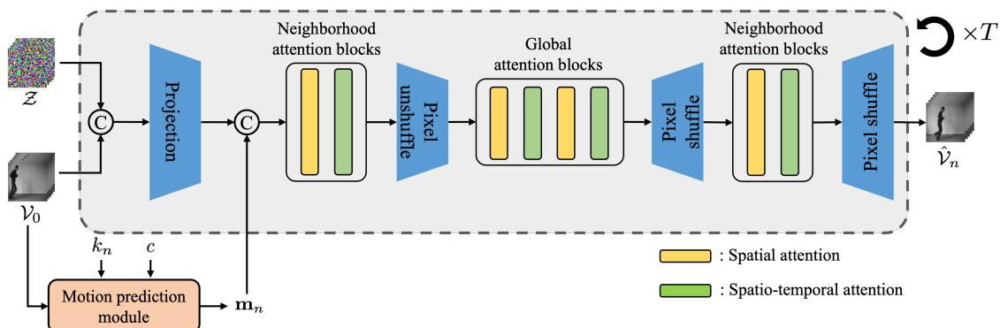
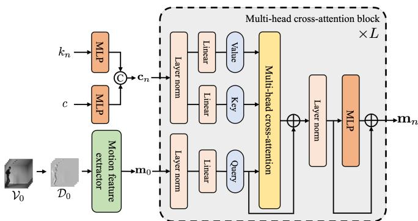
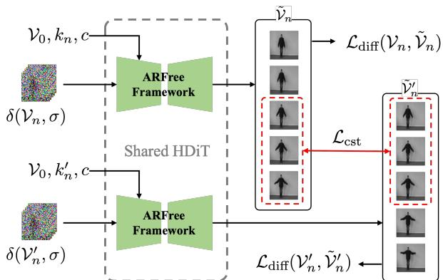
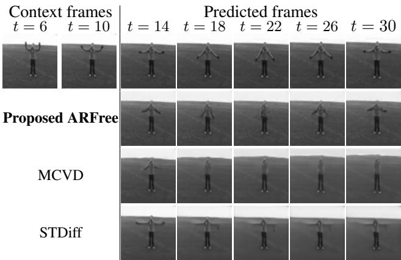
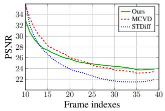
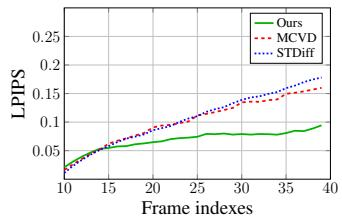

# AUTOREGRESSION-FREE VIDEO PREDICTION USING DIFFUSION MODEL FOR MITIGATING ERROR PROPAGATION

Woonho Ko1 Jin Bok Park1 Il Yong Chun1,2,3,†

1Dept. of Electrical & Computer Engn., Sungkyunkwan University (SKKU), Suwon 16419, South Korea 2Depts. of Artificial Intelligence, Advanced Display Engn., and Semiconductor Converg. Engn., SKKU 3Center for Neuroscience Imaging Research, Inst. for Basic Science (IBS), Suwon 16419, South Korea

## ABSTRACT

Existing long-term video prediction methods often rely on an autoregressive video prediction mechanism. However, this approach suffers from error propagation, particularly in distant future frames. To address this limitation, this paper proposes the first AutoRegression-Free (AR-Free) video prediction framework using diffusion models. Different from an autoregressive video prediction mechanism, ARFree directly predicts any future frame tuples from the context frame tuple. The proposed ARFree consists of two key components: 1) a motion prediction module that predicts a future motion using motion feature extracted from the context frame tuple; 2) a training method that improves motion continuity and contextual consistency between adjacent future frame tuples. Our experiments with two benchmark datasets show that the proposed ARFree video prediction framework outperforms several state-of-theart video prediction methods. Our codes are available at: https://github.com/kowoonho/ARFree.

Index Terms— Video prediction, Diffusion models, Long-term video prediction, Non-autoregressive method

## 1. INTRODUCTION

Video prediction is a challenging computer vision task. It aims to predict plausible future frames from past frames. By predicting future frames at the pixel level, video prediction can be used in various downstream tasks, such as decision-making systems [1], autonomous driving [2], and robotic navigation [3]. However, predicting future frames remains extremely challenging due to the inherent uncertainty in future events. This uncertainty grows exponentially in long-term video predictions.

Existing long-term video prediction methods rely on an autoregressive (AR) video prediction mechanism that uses previously predicted frames for subsequent predictions of future frames. However, this mechanism suffers from error propagation. Prediction errors from previously predicted frames go into subsequent predictions of future frames, leading to significant performance degradations, particularly in predicting distant future frames.

To address this limitation, we propose the first AutoRegression-Free (ARFree) video prediction framework using diffusion models. Different from existing AR video prediction mechanism, the proposed ARFree video prediction mechanism eliminates the dependency on previously predicted frames to mitigate the error propagation issue. This mechanism uses the context frame tuple $\begin{array} { r } { \nu _ { 0 } \ ( \mathrm { i } . \mathrm { e } . \ } \end{array}$ , past frame tuple) for predicting any future frame tuples $\nu _ { n }$ for $n = 1 , \ldots , N$ where N denotes the total number of future frame tuples.

The ARFree video prediction mechanism has two challenges. The first challenge is to model temporal relation between the context frame tuple $\mathcal { V } _ { 0 }$ and a future frame tuple $\nu _ { n } ,$ $n \in \{ 1 , \ldots , N \}$ . In the ARFree video prediction mechanism, there could be a large temporal discontinuity between $\mathcal { V } _ { 0 }$ and $\gamma _ { n } ,$ particularly for $n \in \{ 2 , \ldots , N \}$ , making it difficult to model their temporal relation. The second challenge is to improve motion continuity and contextual consistency between adjacent future frame tuples. Particularly in diffusion-based video prediction models, the stochastic nature of the diffusion process induces randomness in predictions. Without appropriate constraint, this randomness can lead to motion discontinuities and contextual inconsistencies between adjacent future frame tuples, degrading the overall naturalness of the generated video sequence.

This paper proposes two comprehensive solutions to overcome the two aforementioned challenges. First, to explicitly model the temporal relation between the context frame tuple and a future frame tuple, we propose an ARFree motion prediction module that predicts future motion information from the context frame tuple. We then incorporate the predicted future motion information as a conditioning input in the proposed ARFree diffusion model, improving its prediction capability for long-term motion patterns. Second, to improve the motion continuity and the contextual consistency between adjacent future frame tuples, we propose a training method that uses frames in an overlap between time windows from adjacent future frame tuples. Our contributions are summarized as follows:

  
Fig. 1: The overall architecture of the proposed ARFree video prediction diffusion model in the reverse diffusion process. The model predicts the nth future frame tuple by iteratively denoising pure noise frame from the $\mathcal { Z }$ over $T$ steps, given its corresponding motion feature ${ \bf m } _ { n }$ and the context frame tuple $\mathcal { V } _ { 0 }$ . We use the ARFree motion prediction module that extracts ${ \bf m } _ { n }$ from $\mathcal { V } _ { 0 }$ using the frame index of the nth future frame tuple, $k _ { n } ,$ and the corresponding class label c.

• We propose the first ARFree video prediction framework that can moderate the critical error propagation issue in existing AR video prediction approaches.

• We propose an ARFree motion prediction module to explicitly model the temporal relation between the context frame tuple and a future frame tuple.

• We propose a training method to improve the motion continuity and the contextual consistency between adjacent future frame tuples.

• Our experiments with the KTH [4] and NATOPS datasets [5] show that the proposed ARFree video prediction framework outperforms several existing stateof-the-art (SOTA) video prediction methods.

## 2. RELATED WORKS

This section reviews existing video prediction diffusion models. With the emergence of diffusion models [6], there have been efforts to improve prediction quality in video prediction using diffusion models. Residual Video Diffusion (RVD) predicts residual error of the next video frame using diffusion models [7]. Masked Conditional Video Diffusion (MCVD) proposed a unified framework that predicts masked frames using diffusion models for video prediction, generation, and interpolation [8].

However, these methods directly use past frames as input, without predicting motion information. Different from the above methods, Spatio-Temporal Diffusion (STDiff) extracts motion information from pixel-wise differences between two adjacent frames in a tuple of past frames and predicts future motion [9] using a neural stochastic differential equation [10].

This predicted motion is then incorporated as a conditioning input in diffusion models. Latent Flow Diffusion Model (LFDM) [11] and Distribution Extrapolation Diffusion Model (ExtDM) [12] further enrich the motion information by predicting future motion through a diffusion model and decoding it to predict future frames. Yet, the error propagation issue in long-term video prediction remains unresolved.

## 3. BACKGROUNDS

This section includes some backgrounds of diffusion models. Diffusion models [6] are defined by the forward and reverse processes. The forward process iteratively adds isotropic Gaussian noise to a clean sample ${ \bf x } _ { 0 } \colon { \bf x } _ { \sigma } = { \bf x } _ { 0 } + \sigma \epsilon$ , where $\epsilon \sim \mathcal { N } ( \mathbf { 0 } , \mathbf { I } )$ . The standard deviation $\sigma$ of the Gaussian noise is predefined by a monotonically increasing noise level schedule: $\sigma _ { \mathrm { m i n } } ~ \le ~ \sigma ~ \le ~ \sigma _ { \mathrm { m a x } }$ , where $\sigma _ { \mathrm { m i n } }$ and $\sigma _ { \mathrm { m a x } }$ denote the predefined minimum and maximum value of $\sigma ,$ respectively. The reverse process starts with a pure noise sample $\mathbf { x } _ { \sigma _ { \mathrm { m a x } } } \sim \mathcal { N } ( \mathbf { 0 } , \sigma _ { \mathrm { m a x } } ^ { 2 } \mathbf { I } )$ and gradually denoises it using a trained denoiser $D _ { \boldsymbol { \Theta } } ( \mathbf { x } _ { \sigma } , \sigma )$ with parameters θ, generating a clean sample $\mathbf { x } _ { \mathrm { 0 } }$

We follow the EDM formulation to optimize the denoiser $D _ { \boldsymbol { \Theta } }$ using the following objective [13]:

$$
\mathbb {E} _ {\mathbf {x} _ {0}, \epsilon , \sigma} \left[ \lambda_ {\sigma} \| D _ {\theta} (\mathbf {x} _ {\sigma}, \sigma) - \mathbf {x} _ {0} \| _ {2} ^ {2} \right],\tag{1}
$$

where $\lambda _ { \sigma }$ is a weighting function depending on σ. To train the denoiser, EDM uses the preconditioning scheme to scale both the input and output of the objective function. The denoiser is defined as follows [13]:

$$
D _ {\boldsymbol {\theta}} (\mathbf {x} _ {\sigma}, \sigma) = c _ {\mathrm{out}} (\sigma) D _ {\boldsymbol {\theta}} ^ {\prime} \left(c _ {\mathrm{in}} (\sigma) \mathbf {x} _ {\sigma}, c _ {\mathrm{noise}} (\sigma)\right) + c _ {\mathrm{skip}} (\sigma) \mathbf {x} _ {\sigma},
$$

where $D _ { \boldsymbol { \theta } } ^ { \prime }$ is a denoising neural network to be trained, and $c _ { \mathrm { i n } } ( \sigma ) , c _ { \mathrm { o u t } } ( \sigma ) , c _ { \mathrm { n o i s e } } ( \sigma )$ , and $c _ { \mathrm { s k i p } } ( \sigma )$ are predefined preconditioning terms that modulate the input and output at different noise levels.

## 4. METHODOLOGY

This section proposes the first ARFree video prediction diffusion framework. Fig. 1 illustrates its overall architecture. The proposed ARFree video prediction diffusion model predicts the nth future frame tuple $\nu _ { n }$ for $n = 1 , \ldots , N$ , given two conditions, $I )$ its corresponding motion feature ${ \bf m } _ { n }$ and 2) the context frame tuple $\mathcal { V } _ { 0 }$ . We define $\nu _ { n }$ and $\mathcal { V } _ { 0 }$ as follows:

  
Fig. 2: The architecture of the proposed motion prediction module. For query, we extract the motion feature for $\mathcal { V } _ { 0 }$ , m0 in (3). For key and value, we use transformed $\mathbf { c } _ { n } \mathbf { \dot { s } } .$ . We pass query, key, and value through L multi-head cross-attention blocks and ultimately, predict the motion feature corresponding to $\nu _ { n } , \mathbf { m } _ { n }$ in (4).

$$
\begin{array}{l} \mathcal {V} _ {n} := (\mathbf {v} _ {i}: i = F _ {\mathrm{p}} + (n - 1) F _ {\mathrm{f}}, \ldots , F _ {\mathrm{p}} + n F _ {\mathrm{f}} - 1), \\ \mathcal {V} _ {0} := (\mathbf {v} _ {i}: i = 0, \ldots , F _ {\mathrm{p}} - 1), \end{array}\tag{2}
$$

where $\mathbf { v } _ { i }$ denotes the ith video frame in a video sequence, and $F _ { \mathrm { f } }$ and $F _ { \mathfrak { p } }$ denote the number of frames in the future and context frame tuples, respectively. We iteratively denoise pure noise frames from the tuple $\mathcal { Z } : = ( \mathbf { z } _ { i } \sim \mathcal { N } ( \mathbf { 0 } , \sigma _ { \operatorname* { m a x } } ^ { 2 } \mathbf { I } ) : i =$ $1 , \ldots , F _ { \mathrm { f } } )$ over $T$ steps using the proposed ARFree video prediction diffusion model, resulting in the predicted nth future frame tuple $\hat { \mathcal { V } } _ { n }$

To explicitly model the temporal relation between the context frame tuple and a future frame tuple (see Section 1), we propose a motion prediction module that gives $\mathbf { m } _ { n }$ from $\mathcal { V } _ { 0 }$ , using the initial frame index of the nth future frame tuple $k _ { n } : = F _ { \mathrm { p } } + ( n - 1 ) F _ { \mathrm { f } } ,$ and the corresponding class label $c \in \{ 1 , \ldots , C \}$ , ∀n. For a denoising neural network in the ARFree video prediction diffusion model, we modify the Hourglass Diffusion Transformer (HDiT) architecture [14]. Sections 4.1 and 4.2 describe the proposed motion prediction module and denoising neural network architecture, respectively. To improve the motion continuity and the contextual consistency between adjacent future frame tuples (see Section 1), Section 4.3 proposes a training method.

## 4.1. Proposed ARFree motion prediction module

To extract the motion feature for $\gamma _ { 0 } ,$ , m0, we use the gated recurrent unit-based motion feature extractor $E _ { \theta }$ having parameters $\theta _ { \mathrm { e } }$ [15]:

$$
\mathbf {m} _ {0} = E _ {\boldsymbol {\theta} _ {\mathrm{e}}} (\mathcal {D} _ {0}),\tag{3}
$$

where $\mathcal { D } _ { 0 } = ( \mathbf { v } _ { i } - \mathbf { v } _ { i - 1 } : i = 1 , \ldots , F _ { \mathsf { p } } - 1 )$ denotes a tuple of pixel-wise differences between two adjacent frames in $\mathcal { V } _ { 0 }$

Now, we propose a motion prediction module $P _ { \boldsymbol { \Theta } _ { \mathtt { r } } }$ with parameters $\theta _ { \mathrm { p } }$ that predicts the future motion feature for $\gamma _ { n } ,$ ${ \bf m } _ { n }$ . We pass $k _ { n }$ and c through its each two-layer multi-layer perceptron network and concatenate their output to form $\mathbf { c } _ { n }$ The motion prediction module $P _ { \boldsymbol { \Theta } _ { \mathsf { p } } }$ consists of $L$ multi-head cross-attention blocks. In each cross-attention block, we embed $\mathbf { m } _ { 0 }$ obtained in (3) as a query. To incorporate the time and action information, we embed $\mathbf { c } _ { n }$ obtained above as key and value for each cross-attention block. By passing the above query, key, and value through multi-head cross-attention blocks in the $P _ { \boldsymbol { \Theta } _ { \mathsf { p } } }$ , we finally obtain the future motion feature corresponding to the nth future frame tuple, ${ \bf m } _ { n }$

$$
\mathbf {m} _ {n} = P _ {\boldsymbol {\theta} _ {\mathrm{p}}} (\mathbf {m} _ {0}, k _ {n}, c).\tag{4}
$$

Fig. 2 illustrates the architecture of the motion prediction module. By explicitly modeling future motion feature, the proposed module in (4) models the temporal relation between the context frame tuple $\mathcal { V } _ { 0 }$ and the nth future frame tuple $\nu _ { n }$

As a conditioning method in the proposed diffusion model, we simply concatenate its input with ${ \bf m } _ { n }$ in (4).

## 4.2. Modified HDiT architecture for video prediction

This section modifies the HDiT architecture [14] for the proposed ARFree video prediction diffusion models. The original HDiT architecture, designed for image generation [14], contains a series of neighborhood attention blocks and global attention blocks with pixel unshuffle and shuffle [16]. Each attention block is constructed with spatial attention layers. The pixel unshuffle and shuffle are for downsampling and upsampling, respectively.

For the proposed ARFree video prediction framework, we add spatio-temporal attention layers after every spatial attention layers, inspired by [17]. In each spatio-temporal attention layer, we reshape a video tensor by combining its spatial and temporal dimension into a single sequence of tokens. By integrating spatio-temporal information, this attention mechanism promotes temporal correlations between a past frame and a distant future frame, different from the onedimensional temporal attention mechanism commonly used in existing video diffusion models [18, 19]. To incorporate frame index information for a future frame tuple, we apply rotary position embedding to each attention layer [20].

## 4.3. Proposed training method

This section proposes a new training loss that can improve the motion continuity and the contextual consistency between two adjacent future frame tuples (see Section 1). In the proposed training method, the ARFree diffusion model $D _ { \boldsymbol { \Theta } }$ with parameters θ denoises two noisy future frame tuples with overlapping time windows, $\delta ( \aleph _ { n } , \sigma )$ and $\delta ( \gamma _ { n } ^ { \prime } , \sigma )$ where $\delta ( \mathcal { A } , \sigma )$ denotes the forward process that adds isotropic Gaussian noise predefined by noise level schedule σ to frames in tuple ${ \mathcal { A } } .$ . The future frame tuple $\mathcal { V } _ { n } ^ { \prime }$ includes at least one frame in $\nu _ { n }$ (2):

$$
\mathcal {V} _ {n} ^ {\prime} := \left(\mathbf {v} _ {i}: i = F _ {\mathrm{p}} + (n - 1) F _ {\mathrm{f}} + F _ {\mathrm{o}}, \dots , F _ {\mathrm{p}} + n F _ {\mathrm{f}} - 1 + F _ {\mathrm{o}}\right),
$$

  
Fig. 3: The proposed training pipeline of the ARFree video prediction diffusion model framework. In training the proposed diffusion model, we denoise two noisy future frame tuples with overlapping time windows. To improve the motion continuity and the contextual consistency between two adjacent future frame tuples, we use two types of learning objectives: ${ \mathcal { L } } _ { \mathrm { d i f f } }$ and $\mathcal { L } _ { \mathrm { c s t } }$ in (5) and (6), respectively.

for $F _ { 0 } \in \{ 1 , \dots , F _ { \mathrm { f } } - 1 \}$ , where $F _ { \mathbf { o } }$ denotes the number of frames in an overlap between time windows from $\nu _ { n }$ and $\nu _ { n } ^ { \prime } .$ We write denoised versions of $\delta ( \gamma _ { n } , \sigma )$ and $\delta ( \nu _ { n } ^ { \prime } , \sigma )$ , respectively, as follows:

$$
\begin{array}{l} \tilde {\mathcal {V}} _ {n} = D _ {\boldsymbol {\theta}} (\delta (\mathcal {V} _ {n}, \sigma), \mathcal {V} _ {0}, k _ {n}, c, \sigma), \\ \tilde {\mathcal {V}} _ {n} ^ {\prime} = D _ {\boldsymbol {\theta}} (\delta (\mathcal {V} _ {n} ^ {\prime}, \sigma), \mathcal {V} _ {0}, k _ {n} ^ {\prime}, c, \sigma), \end{array}
$$

where $k _ { n } ^ { \prime } : = F _ { \mathrm { p } } + ( n - 1 ) F _ { \mathrm { f } } + F _ { \mathrm { c } }$ denotes the initial frame index of $\mathcal { V } _ { n } ^ { \prime }$

First, we apply the EDM loss function(1) to the nth future frame tuple $\nu _ { n } \left( 2 \right)$ :

$$
\mathcal {L} _ {\text { diff }} (\mathcal {V} _ {n}, \tilde {\mathcal {V}} _ {n}) = \mathbb {E} _ {\boldsymbol {\epsilon}, \sigma} \left[ \frac {\lambda_ {\sigma}}{F _ {\mathrm{f}}} \sum_ {i = 0} ^ {F _ {\mathrm{f}} - 1} \left\| \mathcal {V} _ {n} (i) - \tilde {\mathcal {V}} _ {n} (i) \right\| _ {2} ^ {2} \right],\tag{5}
$$

In the same manner, we apply (1) to the future frame tuple $\mathcal { V } _ { n } ^ { \prime }$ that has an overlap time window with $\gamma _ { n } .$ , by defining the loss $\mathcal { L } _ { \mathrm { d i f f } } ( \nu _ { n } ^ { \prime } , \tilde { \nu } _ { n } ^ { \prime } )$ . Note that we share the denoiser $D _ { \theta }$ in both losses.

Yet, in the aforementioned two losses, $\mathcal { L } _ { \mathrm { d i f f } } ( \mathcal { V } _ { n } , \tilde { \mathcal { V } } _ { n } )$ and $\mathcal { L } _ { \mathrm { d i f f } } ( \nu _ { n } ^ { \prime } , \tilde { \nu } _ { n } ^ { \prime } )$ , we do not model the motion continuity and contextual consistency between two adjacent future frame tuples. We aim to improve the above two properties by promoting the similarity between frames in an overlap between time windows of $\tilde { \mathcal { V } } _ { n }$ and $\tilde { \mathcal { V } } _ { n } ^ { \prime }$ :

$$
\mathcal {L} _ {\mathrm{cst}} := \mathbb {E} _ {\boldsymbol {\epsilon}, \sigma} \left[ \frac {\lambda_ {\sigma}}{F _ {\mathrm{o}}} \sum_ {i = 0} ^ {F _ {\mathrm{o}} - 1} \left\| \tilde {\mathcal {V}} _ {n, o} (i) - \tilde {\mathcal {V}} _ {n, o} ^ {\prime} (i) \right\| _ {2} ^ {2} \right],\tag{6}
$$

where $\tilde { \mathcal { V } } _ { n , 0 }$ and $\tilde { \mathcal { V } } _ { n , 0 } ^ { \prime }$ denote tuples of frames in an overlap between time windows from $\tilde { \mathcal { V } } _ { n }$ and $\tilde { \mathcal { V } } _ { n } ^ { \prime }$ , respectively.

Our total training loss $\mathcal { L } _ { \mathrm { t o t a l } }$ is written by:

$$
\mathcal {L} _ {\text { total }} = \mathbb {E} _ {\mathcal {X}} \left[ \frac {1}{2} \left(\mathcal {L} _ {\text { diff }} (\mathcal {V} _ {n}, \tilde {\mathcal {V}} _ {n}) + \mathcal {L} _ {\text { diff }} (\mathcal {V} _ {n} ^ {\prime}, \tilde {\mathcal {V}} _ {n} ^ {\prime})\right) + \lambda \mathcal {L} _ {\text { cst }} \right],
$$

  
Fig. 4: Qualitative comparisons between different video prediction models (KTH dataset).

where $\mathcal { X } : = \{ \mathcal { V } _ { n } , \mathcal { V } _ { n } ^ { \prime } , \mathcal { V } _ { 0 } , k _ { n } , k _ { n } ^ { \prime } , c \}$ denotes the set of inputs in the diffusion model. We use $\lambda = 0 . 1$ as the default weight. Fig. 3 illustrates the proposed training method.

## 5. RESULTS AND DISCUSSION

This section describes the experimental setups and presents results with some discussion. We compared the proposed AR-Free video prediction framework with several SOTA video prediction methods. In addition, we investigate the contribution of different ARFree variants.

## 5.1. Datasets and evaluation metrics

We ran experiments with two benchmark datasets, the KTH [4] and NATOPS [5] datasets. The KTH dataset consists of videos of 25 people performing $C \ = \ 6$ types of actions: running, jogging, walking, boxing, hand-clapping, and handwaving. For each video, we resized the grayscale video frames to $6 4 \times 6 4$ . We used the videos of 20 people for training and five people for test. The NATOPS dataset includes videos of 20 people performing $C \ = \ 2 4$ types of body-and-hand gestures used for communicating with the U.S. Navy pilots. We changed the spatial resolution of input color video frames to $1 2 8 \times 1 2 8$ . We used videos of ten people for training and another ten people for test.

For training, we randomly sampled 120,000 samples from the videos. In each sample, we used 1) a context frame tuple $\nu _ { 0 } , 2 )$ two adjacent future frame tuples $\nu _ { n }$ and $\mathcal { V } _ { n } ^ { \prime } , \mathcal { 3 } )$ their initial frame indexes $k _ { n }$ and $k _ { n } ^ { \prime } ,$ and 4) the corresponding class label c. For test, we randomly sampled 128 samples from the videos. In each sample, we used $I )$ a context frame tuple $\mathcal { V } _ { 0 } , 2 )$ a future video sequence of $F _ { \mathrm { t o t a l } }$ frames, and 3) the corresponding class label c. We remark that the proposed diffusion model predicts the nth future frame tuple $\nu _ { n }$ for $n = 1 , \ldots , F _ { \mathrm { t o t a l } } / F _ { \mathrm { f } }$ , using the context frame tuple $\mathcal { V } _ { 0 }$ for test. We combined the predicted future frame tuples to generate the total video sequence of $F _ { \mathrm { t o t a l } }$ frames. We set $F _ { \mathfrak { p } }$ and $F _ { \mathrm { f } }$ as 10 and $5 ,$ respectively. We evaluated the proposed ARFree video prediction framework with $F _ { \mathrm { t o t a l } } = 2 0 $ and $F _ { \mathrm { t o t a l } } = 3 0 $ for the KTH dataset, and $F _ { \mathrm { t o t a l } } = 3 0$ for the NATOPS dataset.

Table 1: Comparisons between different video prediction methods with two benchmark datasets

<table><tr><td rowspan="2">Methods</td><td colspan="4">KTH ( $F_p = 10 \rightarrow F_{total} = 20$ )</td><td colspan="4">KTH ( $F_p = 10 \rightarrow F_{total} = 30$ )</td><td rowspan="2">FPS ↑</td><td colspan="4">NATOPS ( $F_p = 10 \rightarrow F_{total} = 30$ )</td><td rowspan="2">FPS ↑</td></tr><tr><td>PSNR ↑</td><td>SSIM ↑</td><td>LPIPS ↓</td><td>FVD ↓</td><td>PSNR ↑</td><td>SSIM ↑</td><td>LPIPS ↓</td><td>FVD ↓</td><td>PSNR ↑</td><td>SSIM ↑</td><td>LPIPS ↓</td><td>FVD ↓</td></tr><tr><td>ExtDM [12]</td><td>21.44</td><td>0.678</td><td>0.217</td><td>576.4</td><td>22.16</td><td>0.711</td><td>0.167</td><td>507.8</td><td>48.19</td><td>23.07</td><td>0.776</td><td>0.131</td><td>1345.9</td><td>10.95</td></tr><tr><td>LFDM [11]</td><td>22.87</td><td>0.699</td><td>0.138</td><td>343.4</td><td>22.47</td><td>0.685</td><td>0.154</td><td>467.6</td><td>2.03</td><td>25.24</td><td>0.853</td><td>0.085</td><td>473.1</td><td>1.09</td></tr><tr><td>RVD [7]</td><td>25.47</td><td>0.810</td><td>0.097</td><td>278.5</td><td>24.18</td><td>0.769</td><td>0.125</td><td>434.7</td><td>0.10</td><td>23.12</td><td>0.797</td><td>0.161</td><td>4027.1</td><td>0.09</td></tr><tr><td>STDiff [9]</td><td>25.31</td><td>0.807</td><td>0.082</td><td>179.4</td><td>24.16</td><td>0.773</td><td>0.107</td><td>282.6</td><td>0.76</td><td>9.09</td><td>0.618</td><td>0.318</td><td>990.8</td><td>0.61</td></tr><tr><td>MCVD [8]</td><td>26.07</td><td>0.850</td><td>0.083</td><td>148.2</td><td>25.04</td><td>0.823</td><td>0.102</td><td>223.2</td><td>2.47</td><td>14.97</td><td>0.690</td><td>0.326</td><td>1443.6</td><td>1.05</td></tr><tr><td>ARFree (Ours)</td><td>26.83</td><td>0.844</td><td>0.055</td><td>120.0</td><td>25.74</td><td>0.813</td><td>0.068</td><td>197.1</td><td>4.41</td><td>28.49</td><td>0.913</td><td>0.054</td><td>339.2</td><td>0.86</td></tr></table>

Table 2: Comparisons between different ARFree variants with the KTH dataset $( F _ { \mathrm { t o t a l } } = 3 0 )$

<table><tr><td>A</td><td>B</td><td>FVD ↓</td><td>PSNR ↑</td><td>SSIM ↑</td><td>LPIPS ↓</td></tr><tr><td>X</td><td>X</td><td>226.7</td><td>25.25</td><td>0.796</td><td>0.076</td></tr><tr><td>O</td><td>X</td><td>210.8</td><td>25.54</td><td>0.802</td><td>0.074</td></tr><tr><td>X</td><td>O</td><td>220.4</td><td>25.53</td><td>0.806</td><td>0.072</td></tr><tr><td>O</td><td>O</td><td>197.1</td><td>25.74</td><td>0.813</td><td>0.068</td></tr></table>

Evaluation metrics. As evaluation metrics, we used peak signal-to-noise ratio (PSNR), structural similarity index measure (SSIM), learned perceptual image patch similarity (LPIPS), Frechet video distance (FVD), and frames-per-´ second (FPS).

## 5.2. Implementation details

As the motion prediction module, we set the number of multihead cross-attention blocks L as 6. For the modified HDiT architecture of the ARFree video prediction diffusion model, we used two neighborhood attention blocks and ten global attention blocks, with the number of channels set to 256 and 512, respectively. We trained the ARFree video prediction diffusion model for 400K steps with a batch size of 16 and used AdamW optimizer with a learning rate of $1 0 ^ { - 4 }$

In training the diffusion model, we followed the default training setup described in [14], and used the exponential moving average of model weights with a decay factor of 0.995. For the reverse process of the diffusion model, we used the linear multistep method with T = 50 sampling steps [21]. To improve the contextual consistency between the video frames, we initialized noise for each video frame with the mixed noise model, similar to [22]. In reproducing existing SOTA methods, we used their default setups specified in the corresponding papers. We conducted all experiments with an NVIDIA GeForce RTX 4090 GPU.

## 5.3. Comparisons between different video prediction methods

Fig. 4 and Table 1 show that the proposed ARFree video prediction framework outperforms four existing SOTA video prediction methods. Fig. 4 shows that the proposed ARFree video prediction framework can achieve more accurate object shapes and improved motion continuities, compared to the existing SOTA methods with the KTH dataset, particularly in distant future frames. Table 1 shows that the proposed ARFree video prediction framework achieves better video prediction performance compared to other SOTA video prediction methods with the KTH and NATOPS datasets.

  
Fig. 5: Frame-wise comparisons with the KTH dataset using PSNR and LPIPS $( F _ { \mathrm { t o t a l } } = 3 0 )$

The results in the tenth and fifteenth columns of Table 1 show that it is challenging to achieve real-time video prediction with all the diffusion models (including ours) except ExtDM [12]. ExtDM generates low-resolution motion cues rather than full video frames, and this can accelerate the entire video prediction process.

## 5.4. Comparisons between different ARFree variants

We evaluated the two key components of ARFree: the proposed ARFree motion prediction module (A) in Section 4.1 and the proposed training method (B) in Section 4.3. Comparing the results in the first and second rows in Table 2 shows that the proposed motion prediction module leads to a performance improvement by modeling the temporal relation between the context and future frame tuples. Comparing the results in the second and fourth rows in Table 2 demonstrates that the proposed training method enhances overall performance by improving motion continuity and contextual consistency between adjacent future frame tuples.

## 5.5. Frame-wise performance comparisons of long-term video prediction

Fig. 5 demonstrates that the proposed ARFree video prediction framework shows lower performance degradation in distant future frames compared to the existing SOTA methods. This result imply that our framework can mitigate the error propagation issue in long-term video prediction.

## 6. CONCLUSION

Error propagation is a critical challenge in long-term video prediction. To moderate this issue, we propose the first AR-Free video prediction framework capable of predicting any future frame tuples, given the context frame tuple. In future work, we aim to extend the proposed framework with datasets with more dynamic motions and improve its computational efficiency for real-time video prediction.

## 7. REFERENCES

[1] F. Ebert, C. Finn, S. Dasari, A. Xie, A. X. Lee, and S. Levine, “Visual foresight: Model-based deep reinforcement learning for vision-based robotic control,” in arXiv preprint arXiv:1812.00568, 2018.

[2] A. Bhattacharyya, M. Fritz, and B. Schiele, “Long-term on-board prediction of people in traffic scenes under uncertainty,” in Proc. IEEE Conference on Computer Vision and Pattern Recognition (CVPR), 2018.

[3] H. S. Koppula and A. Saxena, “Anticipating human activities using object affordances for reactive robotic response,” IEEE Transactions on Pattern Analysis and Machine Intelligence, vol. 38, no. 1, pp. 14–29, 2016.

[4] C. Schuldt, I. Laptev, and B. Caputo, “Recognizing human actions: a local svm approach,” in Proc. International Conference on Pattern Recognition (ICPR), 2004.

[5] Y. Song, D. Demirdjian, and R. Davis, “Tracking body and hands for gesture recognition: Natops aircraft handling signals database,” in Proc. IEEE International Conference on Automatic Face and Gesture Recognition (FG), 2011, pp. 500–506.

[6] J. Ho, A. Jain, and P. Abbeel, “Denoising diffusion probabilistic models,” in Proc. Advances in Neural Information Processing Systems (NeurIPS), 2020, vol. 33.

[7] R. Yang, P. Srivastava, and S. Mandt, “Diffusion probabilistic modeling for video generation,” Entropy, vol. 25, no. 10, 2023.

[8] V. Voleti, A. Jolicoeur-Martineau, and C. Pal, “Mcvd: Masked conditional video diffusion for prediction, generation, and interpolation,” in Proc. Advances in Neural Information Processing Systems (NeurIPS), 2022.

[9] X. Ye and G.-A. Bilodeau, “Stdiff: Spatio-temporal diffusion for continuous stochastic video prediction,” in Proc. AAAI Conference on Artificial Intelligence (AAAI), 2024, vol. 38, pp. 6666–6674.

[10] X. Liu, T. Xiao, S. Si, Q. Cao, S. Kumar, and C.-J. Hsieh, “Neural sde: Stabilizing neural ode networks with stochastic noise,” in arXiv preprint arXiv:1906.02355, 2019.

[11] H. Ni, C. Shi, K. Li, S. X. Huang, and M. R. Min, “Conditional image-to-video generation with latent flow diffusion models,” in Proc. IEEE Conference on Computer Vision and Pattern Recognition (CVPR), 2023.

[12] Z. Zhang, J. Hu, W. Cheng, D. Paudel, and J. Yang, “Extdm: Distribution extrapolation diffusion model for

video prediction,” in Proc. IEEE Conference on Computer Vision and Pattern Recognition (CVPR), 2024, pp. 19310–19320.

[13] T. Karras, M. Aittala, T. Aila, and S. Laine, “Elucidating the design space of diffusion-based generative models,” in Proc. Advances in Neural Information Processing Systems (NeurIPS), 2022.

[14] K. Crowson, S. A. Baumann, A. Birch, T. M. Abraham, D. Z. Kaplan, and E. Shippole, “Scalable highresolution pixel-space image synthesis with hourglass diffusion transformers,” in International Conference on Machine Learning (ICML), 2024.

[15] R. Villegas, J. Yang, S. Hong, X. Lin, and H. Lee, “Decomposing motion and content for natural video sequence prediction,” in Proc. International Conference on Learning Representations (ICLR), 2017.

[16] W. Shi, J. Caballero, F. Husz´ ar, J. Totz, A. P. Aitken, R. Bishop, D. Rueckert, and Z. Wang, “Real-time single image and video super-resolution using an efficient sub-pixel convolutional neural network,” in Proc. IEEE Conference on Computer Vision and Pattern Recognition (CVPR), 2016.

[17] Y. Shi, P. Wang, J. Ye, M. Long, K. Li, and X. Yang, “Mvdream: multi-view diffusion for 3d generation,” in Proc. International Conference on Learning Representations (ICLR), 2024.

[18] J. Ho, T. Salimans, A. Gritsenko, W. Chan, M. Norouzi, and D. J. Fleet, “Video diffusion models,” in Proc. International Conference on Learning Representations (ICLR), 2022.

[19] A. Blattmann, R. Rombach, H. Ling, T. Dockhorn, S. W. Kim, S. Fidler, and K. Kreis, “Align your latents: Highresolution video synthesis with latent diffusion models,” in Proc. IEEE Conference on Computer Vision and Pattern Recognition (CVPR), 2023.

[20] J. Su, M. Ahmed, Y. Lu, S. Pan, W. Bo, and Y. Liu, “Roformer: Enhanced transformer with rotary position embedding,” Neurocomputing, vol. 568, pp. 127063, 2024.

[21] L. Liu, Y. Ren, Z. Lin, and Z. Zhao, “Pseudo numerical methods for diffusion models on manifolds,” in Proc. International Conference on Learning Representations (ICLR), 2022.

[22] S. Ge, S. Nah, G. Liu, T. Poon, A. Tao, B. Catanzaro, D. Jacobs, J.-B. Huang, M.-Y. Liu, and Y. Balaji, “Preserve your own correlation: A noise prior for video diffusion models,” in Proc. IEEE International Conference on Computer Vision (ICCV), 2023.